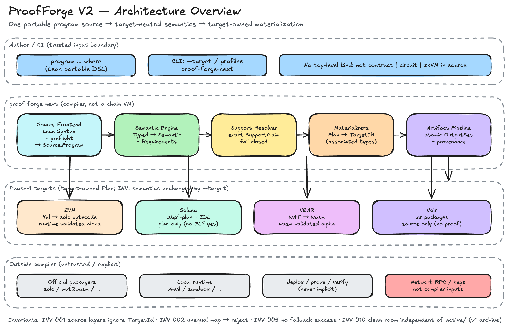
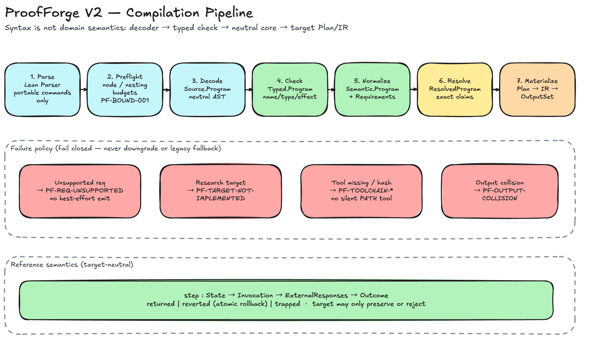
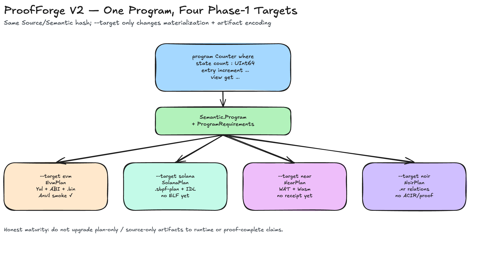

# ProofForge V2 (`proof-forge-next`)

**一份 portable 业务程序源码 → 多个执行平台的受控物化。**

ProofForge V2 是用 **Lean 4** 实现的多目标编译器：作者只写统一的
`program … where` 源码；编译器从源码推导语义需求（requirements），再由
`--target` 选择 **EVM / Solana / NEAR / Noir**（及后续平台）的物化方式。

- **改 target 只能改制品与物化**，不能改整数语义、状态迁移、回滚、调用顺序、
  授权或信息披露语义。
- **无法保持语义时必须拒绝**（稳定诊断），禁止 best-effort 降级或回退到旧路径。
- 编译器是 **代码生成 + 语义检查工具**，不是链上 VM、密钥托管或默认网络执行器。

仓库根目录即 V2 产品工程。旧版 ProofForge（v1）归档在 [`active/`](active/ARCHIVE.md)，
仅作研究参考，**不是**运行时依赖。

---

## 30 秒上手

```lean
import ProofForgeV2
open ProofForgeV2.Language

program Counter where
  state count : UInt64

  init(initial : UInt64) do
    count := initial

  entry increment(delta : UInt64) : UInt64 do
    count := count + delta
    return count

  view get() : UInt64 do
    return count
```

```bash
# 安装 Lean（见 lean-toolchain）后：
just build
just test
# 或本地完整 gate（含 macOS hermetic 子集，见下文）
just ci          # 可移植 Linux / GitHub CI 子集
```

源码 **不** 声明 “合约 / 电路 / zkVM workload” 类别；类别由 `--target` 的物化决定，
且不得偷偷改业务语义。

---

## 架构一览

权威文字规格：[`docs/02-architecture.md`](docs/02-architecture.md)。  
图源（Excalidraw + PNG）在 [`docs/diagrams/`](docs/diagrams/README.md)。

### 系统总览

一份 portable `program` 源码，经 target-neutral 语义与 exact support 求解后，进入
**目标自有** Plan/IR 与制品；外部 packager / runtime / 网络在编译器边界之外。



### 编译管线

`Syntax` 只是入口树，不是领域语义：Parse → Preflight → Decode → Typed → Semantic →
Resolve → Materialize。失败 **fail closed**，禁止降级或 legacy fallback。



### 一源四目标（Phase 1）

同一 `Counter` 语义；`--target` 只改变物化与制品编码。成熟度必须诚实标注
（runtime / plan-only / wasm / source-only）。



### 更多图

| 预览 | 源文件 | 说明 |
|---|---|---|
| [PNG](docs/diagrams/04-requirements-support.png) · [Excalidraw](docs/diagrams/04-requirements-support.excalidraw) | Requirements + SupportClaim 求解（fail closed） |
| [PNG](docs/diagrams/05-target-landscape.png) · [Excalidraw](docs/diagrams/05-target-landscape.excalidraw) | Phase 1 vs design-only + 成熟度阶梯 |
| [PNG](docs/diagrams/06-repo-layout.png) · [Excalidraw](docs/diagrams/06-repo-layout.excalidraw) | 根 = V2；`active/` = v1 归档 |
| [PNG](docs/diagrams/07-module-boundaries.png) · [Excalidraw](docs/diagrams/07-module-boundaries.excalidraw) | 模块边界与禁止依赖 |

编辑白板：打开 [excalidraw.com](https://excalidraw.com) → Open 对应 `.excalidraw` →
导出 PNG 覆盖同名 `0N-*.png`。重新生成 JSON（会覆盖未备份手改）：

```bash
python3 scripts/generate-excalidraw-diagrams.py
```

### 编译数据流（文字）

```text
Author / CI
    │  Lean source + explicit --target / profiles
    ▼
proof-forge-next
    ├─ Lean Parser + portable decoder (+ Syntax preflight)
    │     → Source.Program
    ├─ name / type / effect check
    │     → Typed.Program
    ├─ target-neutral normalization
    │     → Semantic.Program + ProgramRequirements
    ├─ Support resolver (exact SupportClaim, fail closed)
    │     → ResolvedProgram target
    ├─ target Materializer
    │     → target Plan → TargetIR
    └─ emitter
          → OutputSet + provenance (atomic write)
                │
                ├─ official packager / validator / local runtime
                └─ deploy / prove / verify   ← 仅显式命令，不隐式联网
```

前端直接使用 Lean 4 的 `Syntax`，但 **不把 Lean AST 当作领域语义**。CLI 只解析允许的
portable command，不 elaboration / 执行用户文件中的任意 Lean command。

关键不变量（摘要）：

| ID | 含义 |
|---|---|
| INV-001 | Source / Typed / Semantic 层不按 `TargetId` 分支 |
| INV-002 | target 只能做等价物化；否则拒绝 |
| INV-005 | 任一失败不得变成“成功”或 legacy fallback |
| INV-008 | build 无网络与密钥副作用；deploy/prove/verify 显式 |
| INV-010 | clean-room 不依赖 `active/` 或旧 v1 路径 |

---

## 目标与成熟度（诚实表）

| Target | 角色 | 本阶段 | 证据状态（不得夸大） |
|---|---|---|---|
| `evm` | contract VM | Phase 1 | Counter bytecode + Anvil 初始化/increment/overflow；**非**完整 EVM 后端 |
| `solana` | explicit-account SVM | Phase 1 | typed `.sbpf-plan` + IDL；**无** sBPF object / ELF / runtime |
| `near` | Wasm host | Phase 1 | raw-u64 Counter/Accumulator WAT/Wasm + `wat2wasm`；**无** sandbox receipt |
| `noir` | circuit | Phase 1 | target-owned Plan / relation IR → `.nr` packages；**无** Nargo/ACIR/proof/VK |
| CosmWasm / Soroban / ICP / OpenVM / Aleo / Psy | — | design / research | 仅档案与路线图，**无** 产品后端宣称 |

详情：[`docs/targets/README.md`](docs/targets/README.md)。

---

## 仓库结构

```text
.
├── ProofForgeV2/          # 编译器（Core · Language · Targets · CLI）
├── Examples/              # 可编译示例程序
├── Tests/                 # 单元 / 物化测试
├── docs/                  # PRD · 架构 · 规格 · ADR · diagrams
├── scripts/               # CI · clean-room · toolchain · 文档检查
├── justfile               # 本地与 CI 门禁入口
├── active/                # 归档的 v1 全树（研究 only）
└── AGENTS.md              # 给 agent / 贡献者的控制面
```

---

## 文档从哪读

| 想了解 | 打开 |
|---|---|
| 生命周期与权威索引 | [`docs/document-status.md`](docs/document-status.md) |
| 文档导航 | [`docs/index.md`](docs/index.md) |
| 产品需求 | [`docs/01-prd.md`](docs/01-prd.md) |
| 系统架构 | [`docs/02-architecture.md`](docs/02-architecture.md) |
| 任务与验收 | [`docs/04-task-breakdown.md`](docs/04-task-breakdown.md) |
| 实现事实日志 | [`docs/06-implementation-log.md`](docs/06-implementation-log.md) |
| Agent 工作协议 | [`AGENTS.md`](AGENTS.md) |

**权威顺序：** 已接受 ADR/PRD/架构/规格 → 可复现 gate/evidence → 当前代码与制品。  
调研材料是证据输入，不会自动变成规范。

---

## 开发与 CI

```bash
just docs-check    # 文档控制面
just build         # Lake: ProofForgeV2 + proof-forge-next
just test          # proof-forge-next-tests
just ci            # 可移植子集（GitHub / Woodpecker 使用）
just check         # 完整本地 gate（含 macOS hermetic / 锁定工具链）
just v2-clean-room-alpha   # clean-room 开发门禁（非正式 hermetic release）
```

| 表面 | 命令 / 配置 | 宣称 |
|---|---|---|
| Hosted CI | `.github/workflows/ci.yml`、`.woodpecker.yml` → `just ci` | Linux portable：docs + build/test + 负例 |
| 密钥扫描 | `secret-scan` workflow | only-verified TruffleHog |
| 本地 hermetic | `just check` / `v2-clean-room-alpha` | 需 macOS host profile + darwin-arm64 锁定工具；**不是** release EV |

首次物化锁定工具（本地 hermetic，非普通 `just ci`）：

```bash
just toolchains-provision-lean
just toolchains-provision-external
```

---

## 当前状态（alpha）

V2 完成了文档/规格基线与 **不可发布** 的 alpha 骨架：独立 Lake、统一 DSL 入口、
Core 与四目标 materializer 的最小连通性。**不等于 Phase 1 完成。**

- Clean-room development gate 已可跑，但当前 host 可能 `Sealed: Broken` 等，
  **不能**当作正式 hermetic / release evidence。
- 详见实现日志与 document status；写 maturity 时以 **代码 + 可复现 gate** 为准。

---

## 许可

见根目录 [`LICENSE`](LICENSE)。
