# ProofForge System Architecture · Visual Guide

Status: **visual-first guide (2026-07-15)**

Prefer this page when Mermaid feels dense. It uses:

1. **SVG overviews** (render inline on GitHub / VS Code)
2. **Excalidraw PNG exports** (hand-drawn presentation style)
3. **Editable `.excalidraw` sources** ([excalidraw.com](https://excalidraw.com))

Deep text inventory:
[system-architecture.md](system-architecture.md).
中文视觉版: [zh/system-architecture-visual.zh.md](zh/system-architecture-visual.zh.md).

## Regenerate

```bash
python3 scripts/generate-architecture-svg.py
python3 scripts/generate-excalidraw-diagrams.py   # .excalidraw JSON only
```

## Figure 1 · Overview

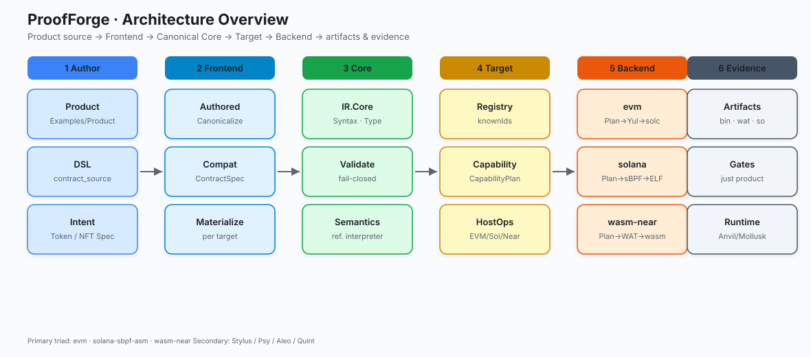

## Figure 2 · Primary pipeline

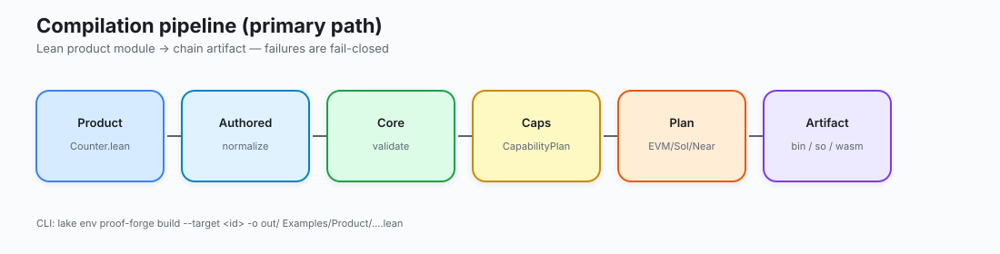

## Figure 3 · One source, three targets

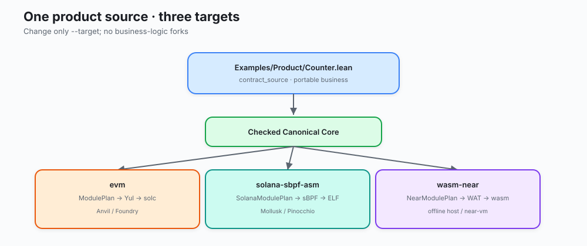

## Figure 4 · Layer stack

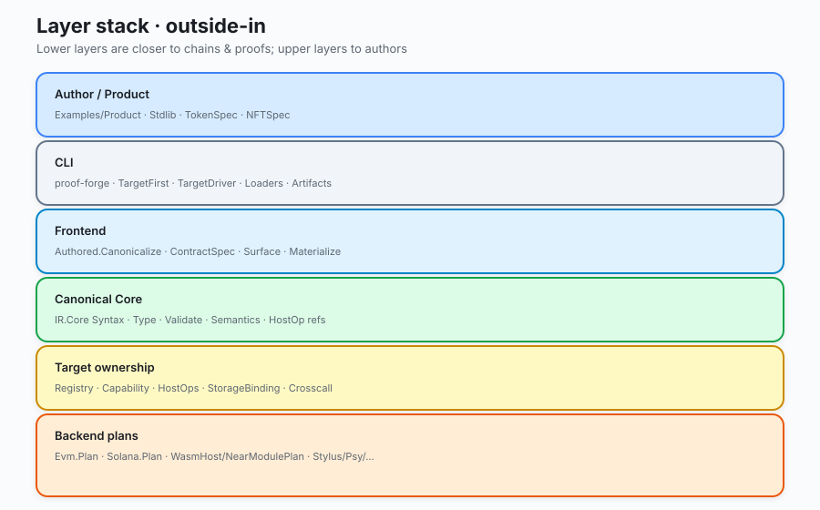

## Figure 5 · Component cards

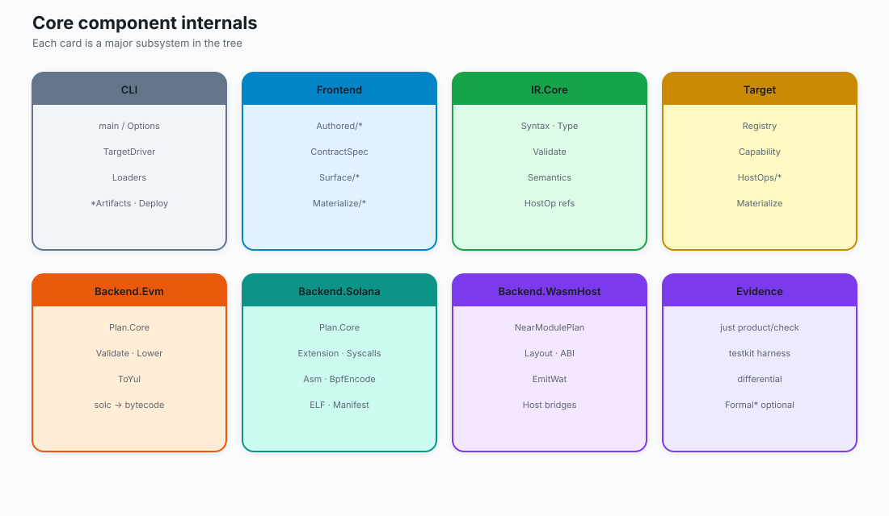

## Figure 6 · Excalidraw PNG gallery

| Diagram | Image |
|---|---|
| Platform overview | 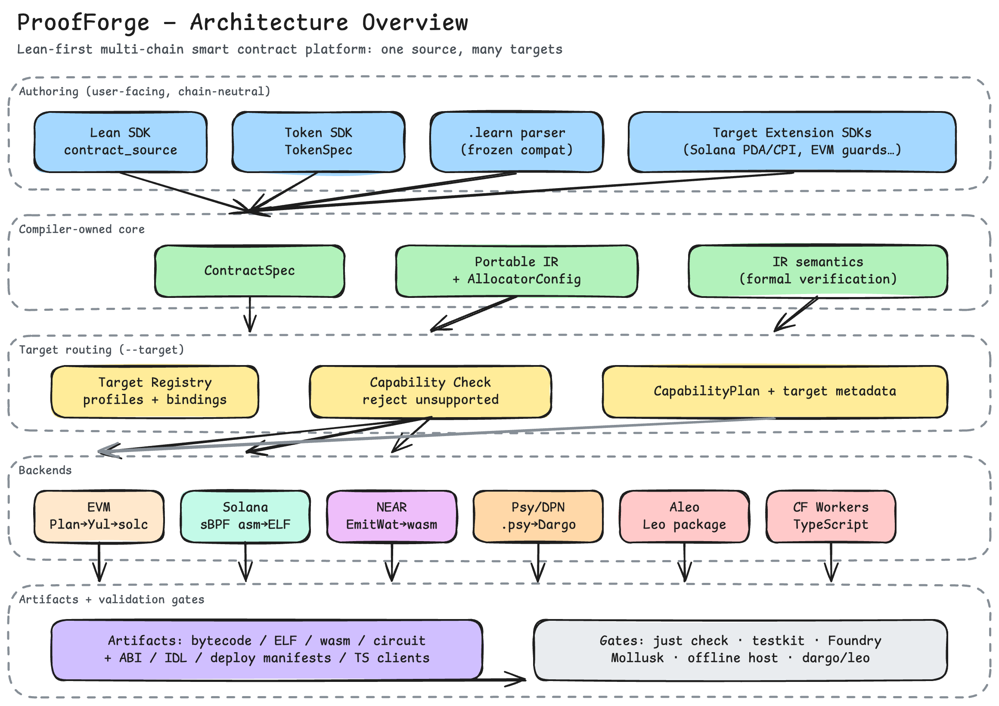 |
| Nine-stage pipeline | 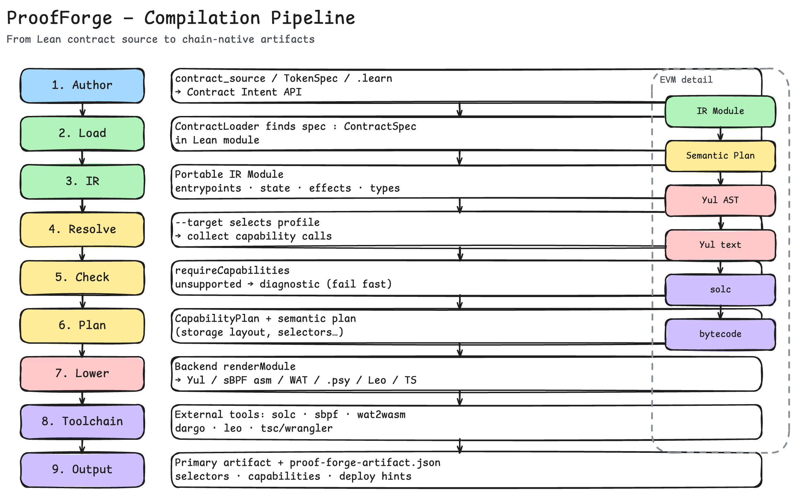 |
| One contract, three targets | 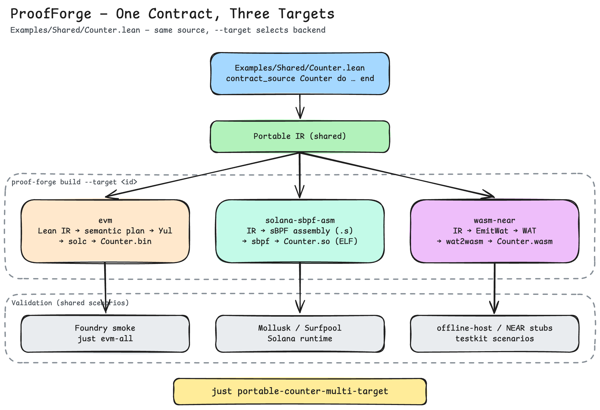 |
| Capability routing | 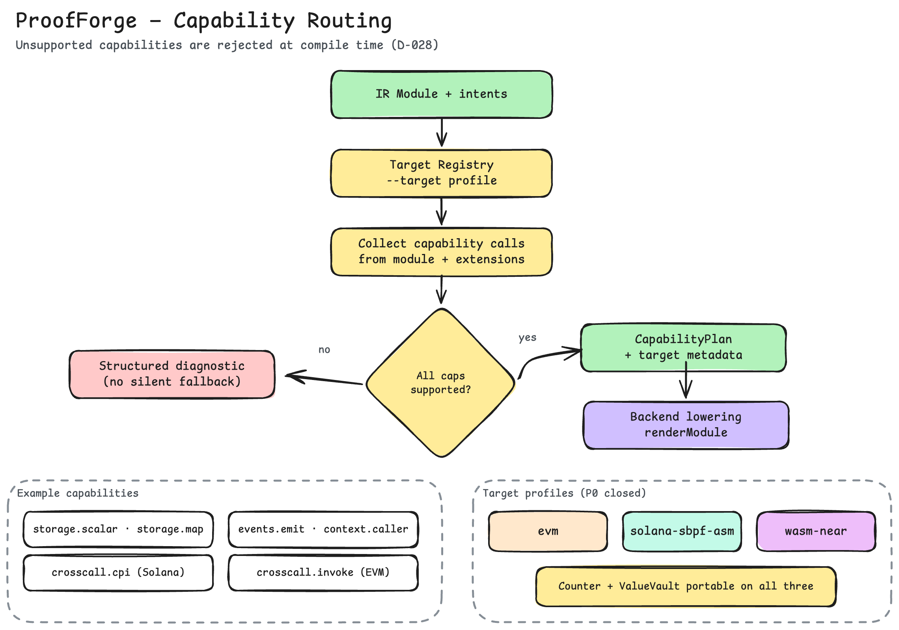 |
| Developer workflow | 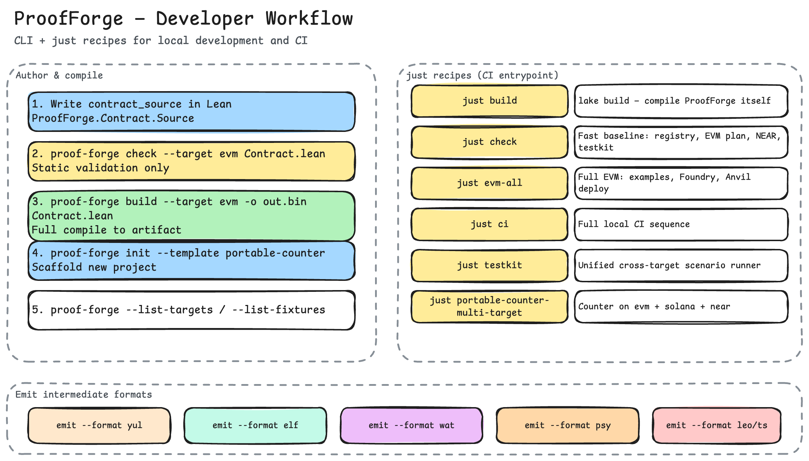 |
| Codebase layout | 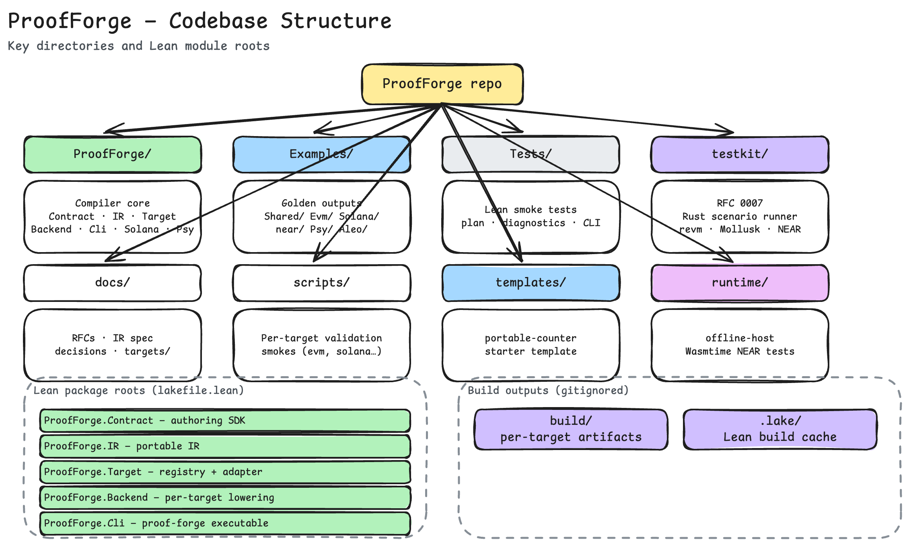 |
| Target landscape | 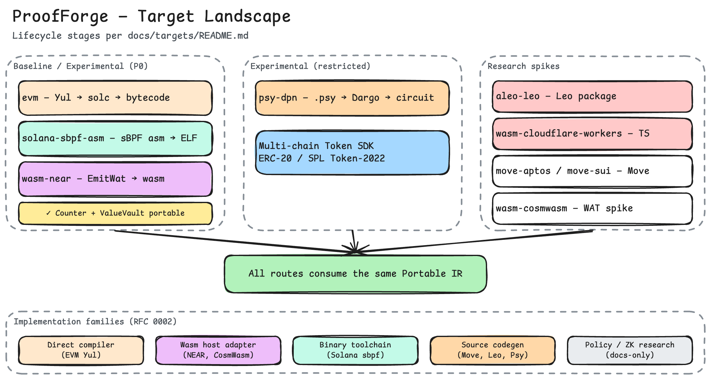 |

Catalog: [diagrams/README.md](diagrams/README.md).

> Excalidraw JSON may still carry some historical labels. Treat the **SVG set**
> and **code** as current; refresh Excalidraw text via the generator when needed.
