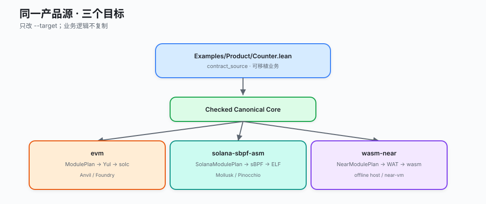
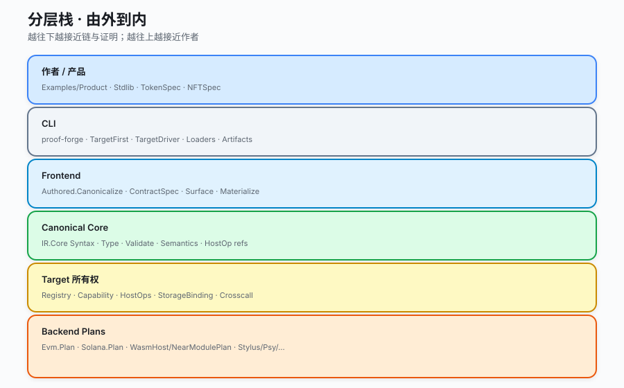
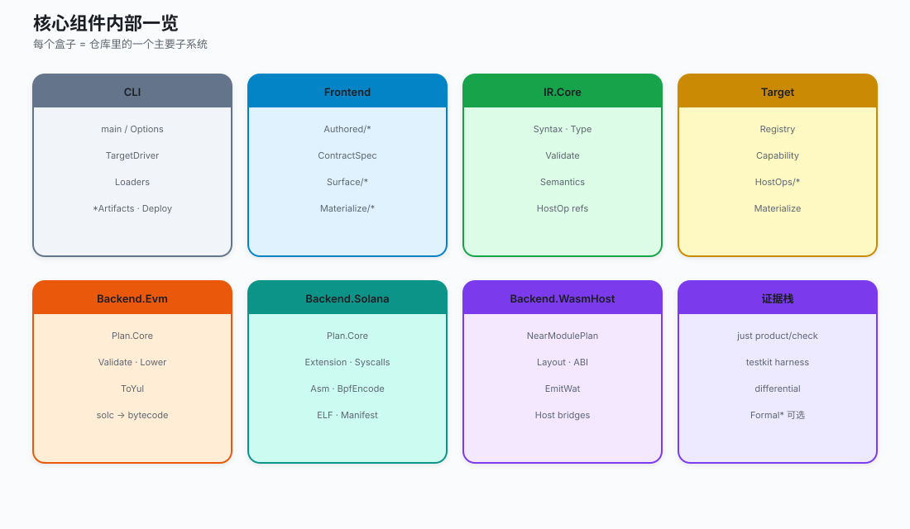

# ProofForge 系统架构 · 视觉导览

状态：**视觉优先导览（2026-07-15）**

如果你觉得纯 Mermaid 图又密又不好看，**请先读本文**。这里用：

1. **新版 SVG 总图**（GitHub / VS Code 预览可直接显示，风格统一）
2. **既有 Excalidraw 导出 PNG**（手绘演示风，更适合演讲）
3. **可编辑 `.excalidraw` 源文件**（可在 [excalidraw.com](https://excalidraw.com) 打开）

文字深拆、组件清单仍在：
[system-architecture.zh.md](system-architecture.zh.md)。

---

## 怎么选图

| 你想… | 看什么 |
|---|---|
| 30 秒理解整体 | 下面 **图 1 总览** |
| 理解编译步骤 | **图 2 流水线** |
| 理解「一源三链」 | **图 3** |
| 理解分层归属 | **图 4 分层栈** |
| 理解各子系统内部 | **图 5 组件卡** |
| 演讲 / 可拖拽编辑 | [Excalidraw 图集](../diagrams/README.md) + PNG |
| 抠细节到模块路径 | [中文深拆](system-architecture.zh.md) |

重新生成 SVG：

```bash
python3 scripts/generate-architecture-svg.py
```

重新生成 Excalidraw JSON：

```bash
python3 scripts/generate-excalidraw-diagrams.py
```

---

## 图 1 · 架构总览（六列）

从左到右：作者 → Frontend → Core → Target → Backend → 证据。


---

## 图 2 · 编译主路径（一排）

最直观的主路径。任何一步失败都 **fail-closed**，不会静默改走 legacy 当成功。


```bash
lake env proof-forge build --target evm --root . \
  -o build/evm/Counter.bin Examples/Product/Counter.lean
```

---

## 图 3 · 同一产品源 · 三个目标

只改 `--target`，业务逻辑不复制。



---

## 图 4 · 分层栈（由外到内）

上面靠近作者，下面靠近链与证明。



---

## 图 5 · 核心组件内部

每张卡对应仓库里的一个主要子系统。



---

## 图 6 · Excalidraw / PNG 图库（演示风）

仓库里早就有一套手绘风图（比密 Mermaid 更适合演示）。GitHub 上直接看 PNG：

### 平台总览


### 编译九段


### 一合约三目标


### 能力路由


### 开发者工作流


### 代码库布局


### 目标全景


可编辑源文件目录：[docs/diagrams/](../diagrams/README.md)

| 文件 | 内容 |
|---|---|
| `01-architecture-overview.excalidraw` | 端到端分层 |
| `02-compilation-pipeline.excalidraw` | 九段编译 + EVM 细节 |
| `03-multi-target-counter.excalidraw` | Counter 三目标 |
| `04-capability-routing.excalidraw` | 能力与 fail-fast |
| `05-developer-workflow.excalidraw` | CLI / just |
| `06-codebase-structure.excalidraw` | 仓库布局 |
| `07-target-landscape.excalidraw` | 目标生命周期 |

> 说明：Excalidraw 生成脚本仍带部分历史标签（如早期 CF Workers）。**语义以 SVG 新图 + 代码为准**；若要同步 Excalidraw 文案，改 `scripts/generate-excalidraw-diagrams.py` 后重跑。

---

## 一句话模型（对照图用）

```text
  业务源码  →  检查后的含义  →  目标计划  →  制品  →  证据
  (Product)     (Canonical Core)   (Plan)      (bin)    (gates)
```

| 层 | 关键目录 |
|---|---|
| 作者 | `Examples/Product`, `ProofForge/Contract` |
| CLI | `ProofForge/Cli` |
| Frontend | `ProofForge/Frontend` |
| Core | `ProofForge/IR/Core` |
| Target | `ProofForge/Target` |
| Backend | `ProofForge/Backend/{Evm,Solana,WasmHost}` |
| 证据 | `justfile`, `scripts/`, `testkit/` |

---

## 下一步读什么

1. 想抠模块路径与迁移诚实 → [system-architecture.zh.md](system-architecture.zh.md)
2. 只关心 Canonical 语义边界 → [architecture.zh.md](architecture.zh.md)
3. 各链成熟度 → [targets-README.zh.md](targets-README.zh.md)
4. 英文对照图 → [../diagrams/svg/](../diagrams/svg/) 的 `*.en.svg`
