# ProofForge 系统架构全景（中文）

状态：**当前导向图（2026-07-15）**

> **想先看图、要好看？** 请先打开视觉导览（SVG + Excalidraw PNG）：  
> **[system-architecture-visual.zh.md](system-architecture-visual.zh.md)**  
> 本文是 **文字深拆 + Mermaid 结构图**；细节全，但不如视觉版直观。

行为以代码与门禁为准；排期以 [AGENTS.md](../../AGENTS.md) 与当前 plan 为准。

| 相关文档 | 说明 |
|---|---|
| **[视觉导览（推荐先读）](system-architecture-visual.zh.md)** | SVG 总图 + Excalidraw PNG |
| [英文版 system-architecture.md](../system-architecture.md) | 英文深拆；§12 分层内部 |
| [规范编译器架构](architecture.zh.md) | Canonical 语义 vs 目标物化 |
| [后端接口](../backend-interface.md) | 目标计划义务 |
| [产品编写架构](../product-authoring-architecture.md) | 业务意图 vs 链上物化 |
| [目标笔记索引](targets-README.zh.md) | 各链成熟度与诚实边界 |

### 视觉摘要（嵌入）

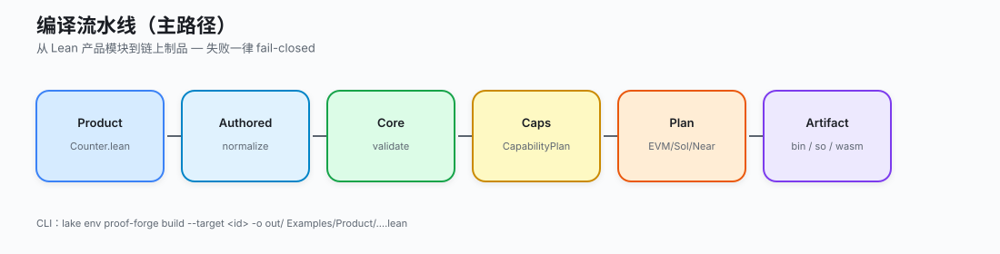

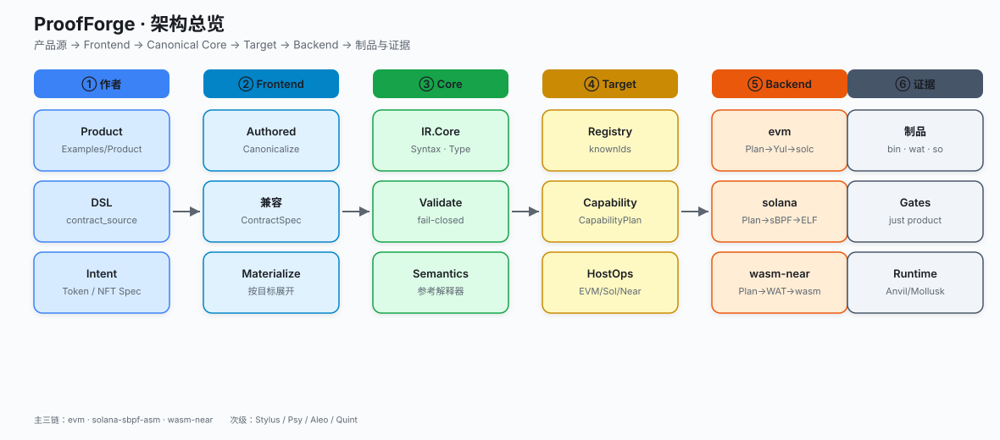

---

## 目录

1. [一句话模型](#1-一句话模型)
2. [全局鸟瞰](#2-全局鸟瞰)
3. [仓库与 Lake 包](#3-仓库与-lake-包)
4. [端到端编译流水线](#4-端到端编译流水线主三链)
5. [分层拆解 + 组件内部](#5-分层拆解--组件内部结构)
   - [5.1 CLI](#51-cli-层-proofforgecli)
   - [5.2 产品 / Contract](#52-产品与作者层-contract--examples)
   - [5.3 Frontend](#53-frontend-归一化层)
   - [5.4 Canonical Core](#54-canonical-core--ir-层)
   - [5.5 Target](#55-target-目标所有权层)
   - [5.6 Compiler 共享](#56-compiler-共享打印与流水线)
   - [5.7 Backend EVM](#57-backend-evm-内部)
   - [5.8 Backend Solana](#58-backend-solana-内部)
   - [5.9 Backend WasmHost](#59-backend-wasmhost-内部)
   - [5.10 次级后端](#510-次级--研究后端-stylus--psy--aleo--quint)
   - [5.11 验证与证据](#511-验证--testkit--formal--differential)
6. [跨边界数据对象](#6-跨边界数据对象)
7. [Counter 三链实例](#7-worked-example-counter-三链)
8. [迁移与双路径诚实](#8-迁移双路径诚实必读)
9. [组件清单](#9-组件清单自检)
10. [如何读代码](#10-如何安全地读代码)

---

## 1. 一句话模型

**ProofForge = Lean 4 多目标智能合约编译器：** 作者写一次可移植业务逻辑 →
经检查后的语义核（Canonical Core）→ **目标自有 Plan** → 链上制品（Yul / sBPF /
WAT…）→ 能力诊断 + 离线宿主 +（可选）形式化 / 原生对照证据。

```text
  业务源码  →  检查后的含义  →  目标计划  →  制品  →  证据
  (Lean DSL)    (Canonical Core)   (每条链)    (bin/wat)  (测试/运行时)
```

---

## 2. 全局鸟瞰

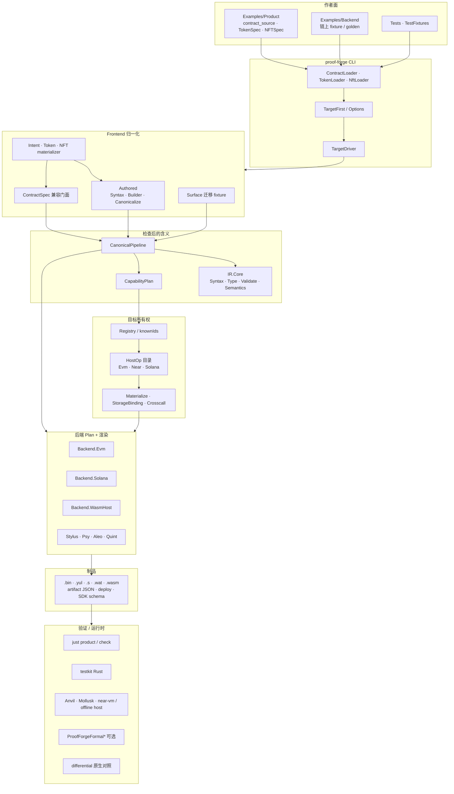

---

## 3. 仓库与 Lake 包

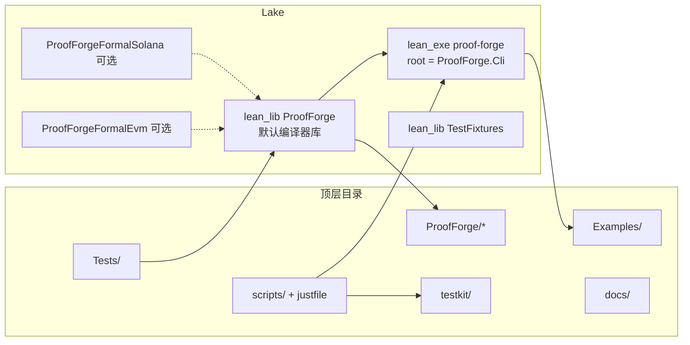

| 路径 | 职责 |
|---|---|
| `ProofForge/Cli/` | 命令行、加载、target-first 分发、emit/build/check |
| `ProofForge/Frontend/` | Authored / Surface / ContractSpec 归一化 |
| `ProofForge/Contract/` | 产品 DSL、Stdlib、Token/NFT、Intent |
| `ProofForge/IR/` | 可移植/Legacy IR + **Canonical Core** |
| `ProofForge/Compiler/` | CanonicalPipeline + Yul/Wasm/Psy/Leo 打印机 |
| `ProofForge/Backend/` | 各目标 Plan 与 lowering |
| `ProofForge/Target/` | 注册表、能力、HostOp、物化、诚实诊断 |
| `Examples/Product/` | **唯一**共享业务产品源 |
| `Examples/Backend/` | 链专用 fixture（不是产品作者语言） |
| `testkit/` | Rust 多后端对照与 harness |
| `ProofForgeFormal/` | 重量级可选证明（不进默认库） |

---

## 4. 端到端编译流水线（主三链）

公开 beta 产品编译器：`evm` · `solana-sbpf-asm` · `wasm-near`。

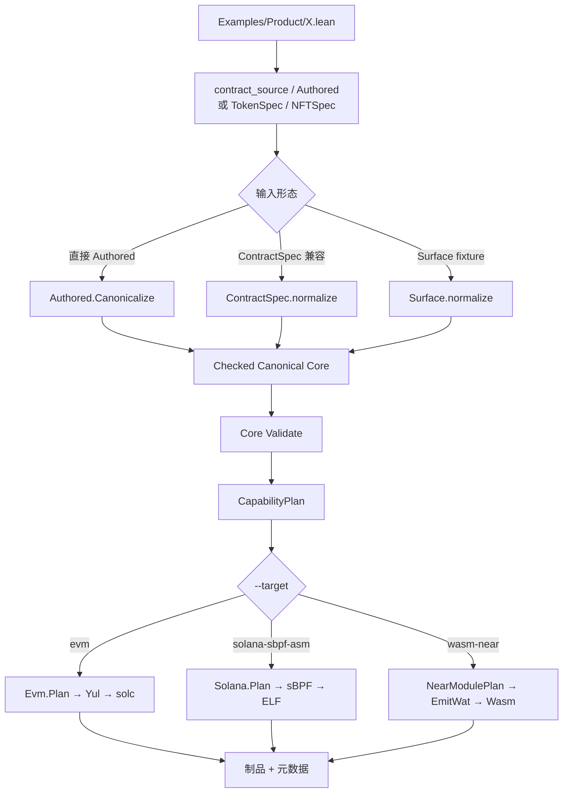

### CLI 调用时序

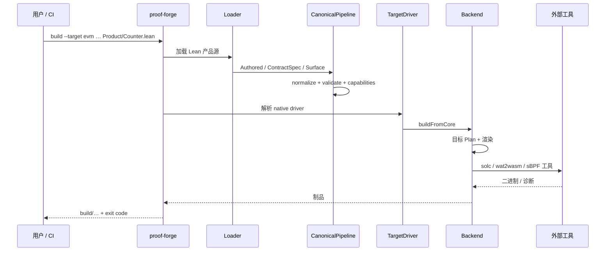

```bash
lake env proof-forge build --target evm --root . \
  -o build/evm/Counter.bin Examples/Product/Counter.lean
```

---

## 5. 分层拆解 + 组件内部结构

### 5.1 CLI 层（`ProofForge/Cli`）

CLI 是**对外唯一可执行入口**：解析参数 → 加载源 → 调流水线 → 写制品 / 部署辅助。

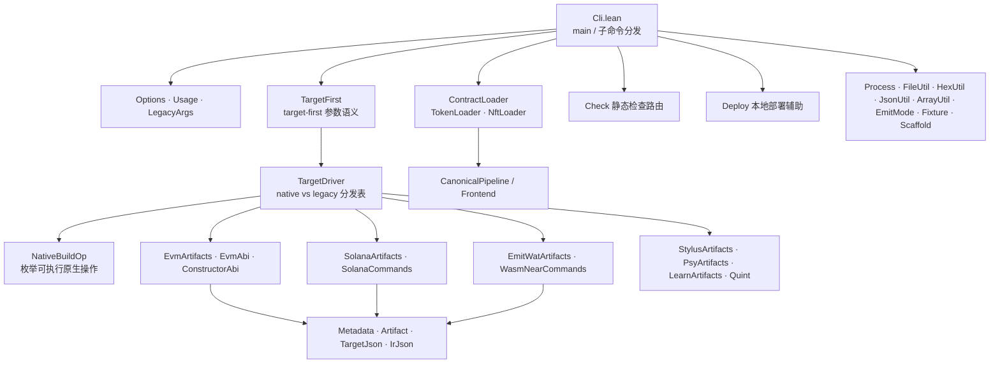

| 子模块族 | 代表文件 | 内部职责 |
|---|---|---|
| 入口与参数 | `Cli.lean`, `Options`, `Usage`, `LegacyArgs` | argv、帮助、旧旗标兼容窗口 |
| Target-first | `TargetFirst`, `TargetDriver`, `NativeBuildOp` | 把用户意图映射到 native 构建操作，禁止静默 fallback 成功 |
| 加载器 | `ContractLoader`, `TokenLoader`, `NftLoader` | 解析 Lean 产品模块 / intent 输入 |
| 制品写出 | `*Artifacts.lean` | 按目标写 `build/` 下文件 |
| ABI/元数据 | `Metadata`, `EvmAbi`, `ConstructorAbi`, `Artifact` | 部署图、selector、schema 诚实性 |
| 链命令 | `Deploy`, `SolanaCommands`, `WasmNearCommands` | 本地 smoke 包装，不是编译语义 |
| 工具 | `Process`, `*Util` | 进程、十六进制、JSON 等 |

**运行要点：** `TargetDriver` 里每个 `(target, emit/build 形态)` 显式注册；未知组合
fail-closed，而不是猜一条 legacy 路径。

---

### 5.2 产品与作者层（`Contract` + `Examples`）

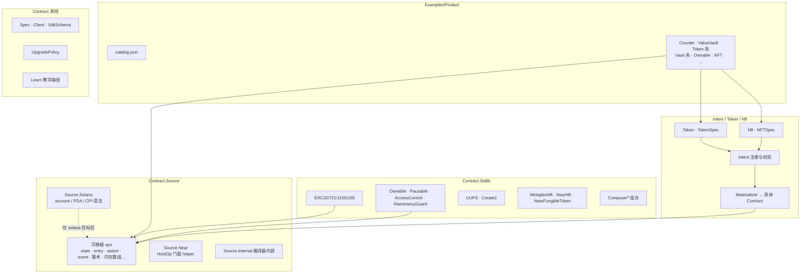

| 组件 | 内部结构要点 |
|---|---|
| `contract_source` | Lean 宏：产品 DSL → `AuthoredContract`（迁移期仍可能经 ContractSpec） |
| `Source/*` | 可移植语法为默认；`Source.Solana` 持有账户图语法；NEAR helper 不进共享 Core 构造子 |
| `Stdlib/*` | 标准模式库：多数带 EVM ABI 元数据，核心逻辑尽量可移植 |
| `Token/` · `Nft/` · `Intent/` | 意图层：校验 feature → 注册表选 materializer → 产出可编译合约 |
| `Examples/Product` | 多目标唯一业务源；`catalog.json` 驱动产品矩阵门禁 |
| `Examples/Backend` | 后端探针与 golden，**不是**教程产品路径 |

**产品原则：** 作者只选 `--target`；账户 / slot / promise 细节由目标物化层完成。

---

### 5.3 Frontend 归一化层

Frontend 把**不同作者输入**收成同一套 **Canonical Core**，且**不得**在可移植
归一化里按 `targetId` 分支。

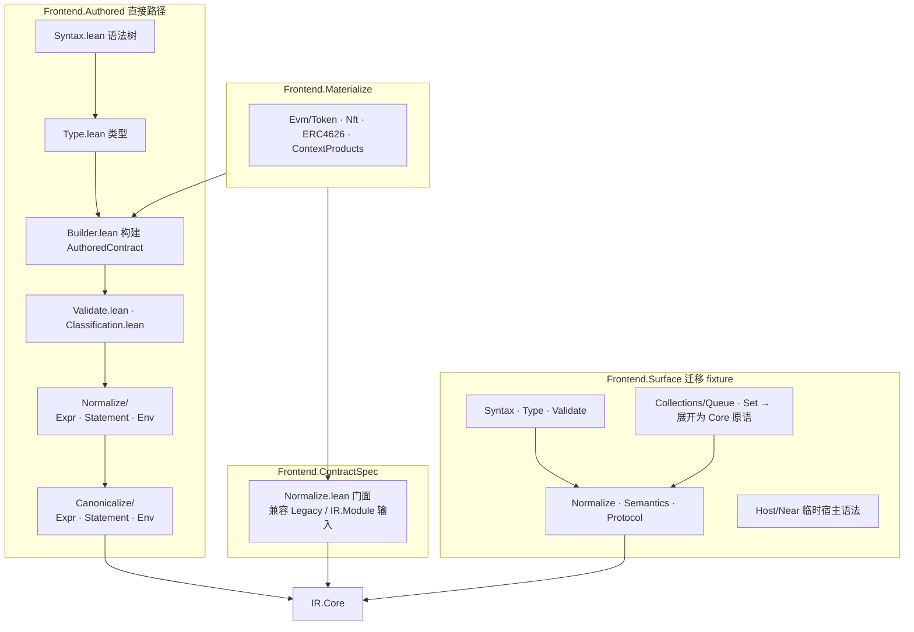

| 子树 | 输入 | 输出 | 备注 |
|---|---|---|---|
| `Authored/*` | 产品宏输出 | Core | cutover 主路径（PR #104 方向） |
| `ContractSpec/*` | 旧 `ContractSpec` / IR | Core | 兼容；逐步删调用方 |
| `Surface/*` | 临时 Surface AST | Core | 非产品；A-CUT4 后删除 |
| `Materialize/*` | Intent 特征集 | 具体合约 | 按 (target, family) 注册，fail-closed |

**Canonicalize 内部：** `Env` 跟踪绑定 → `Expr` 降到 Core 表达式 → `Statement`
降到基本块；`Validate` 在降前拒绝畸形签名/事件 schema。

---

### 5.4 Canonical Core / IR 层

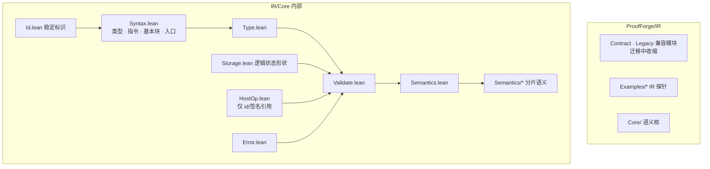

| 模块 | 拥有什么 | **不**拥有什么 |
|---|---|---|
| `Syntax` | 逻辑 op、控制流、事件、hostCall 载体 | EVM slot、Solana 账户偏移 |
| `Validate` | 类型/effect/HostOp 签名闭合检查 | 目标物理布局 |
| `Semantics` | 参考解释器 / fuel | 真实链 gas 语义的完整模型 |
| `Storage` | scalar/map/array 等逻辑形状 | 链上 key 编码细节 |

**CanonicalPipeline（`Compiler/CanonicalPipeline.lean`）** 编排：

```text
加载输入 → 选 Authored | ContractSpec | Surface 归一化
  → Core Validate
  → 解析 CapabilityPlan
  → 调用目标 buildFromCore
失败一律 fail-closed（不得静默改走 legacy 当成功）
```

---

### 5.5 Target 目标所有权层

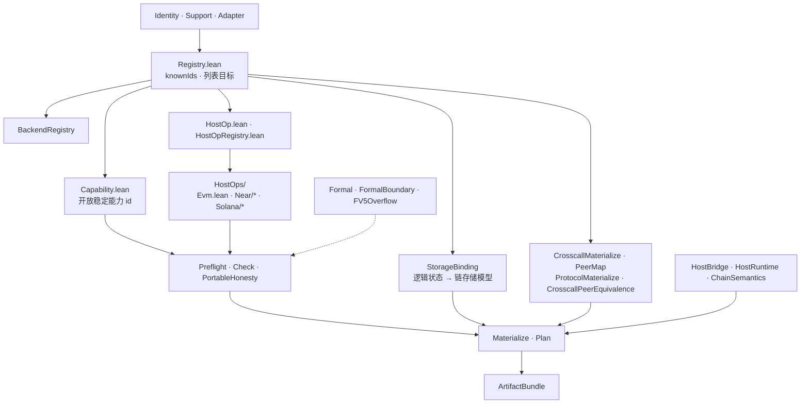

| 组件 | 内部职责 |
|---|---|
| `Registry` | 目标 id、元数据、与 CLI `--list-targets` 对齐 |
| `Capability` | 程序声明需要的能力；计划阶段闭合 |
| `HostOp*` | **版本化** 精确签名；无“最近版本”模糊匹配 |
| `HostOps/Evm\|Near\|Solana` | 目录 + handler：上下文、协议、系统调用、宿主导入 |
| `StorageBinding` | 可移植 storage 形状 → EVM slot / account data / host KV 等 |
| `Crosscall* / Protocol*` | 远程调用与协议对等体，不写死链上地址在产品源里 |
| `PortableHonesty` | “我们不假装支持” 的诊断 |
| `Preflight` | 编译前资源/能力硬检查 |

**边界（D-054）：** 链原生 API 不得进入共享 Core 构造子；必须走目标 extension /
HostOp。

---

### 5.6 Compiler 共享打印与流水线

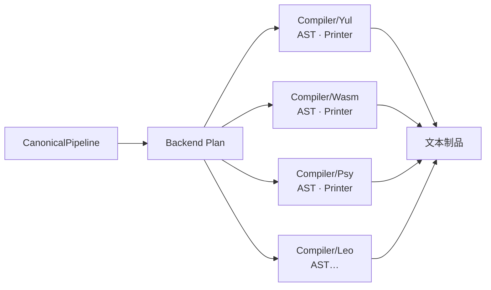

| 目录 | 角色 |
|---|---|
| `Compiler/CanonicalPipeline` | 归一化 + 校验 + 调目标 |
| `Compiler/Yul` | EVM 共用 Yul AST/打印（镜像 Backend 输出） |
| `Compiler/Wasm` | Wasm/WAT AST/打印（EmitWat 下游） |
| `Compiler/Psy` | `.psy` 源码 AST/打印 |
| `Compiler/Leo` | Aleo Leo 源码相关 |

打印机应是**纯结构渲染**：形状解析与语义决策留在 Backend Plan。

---

### 5.7 Backend EVM 内部

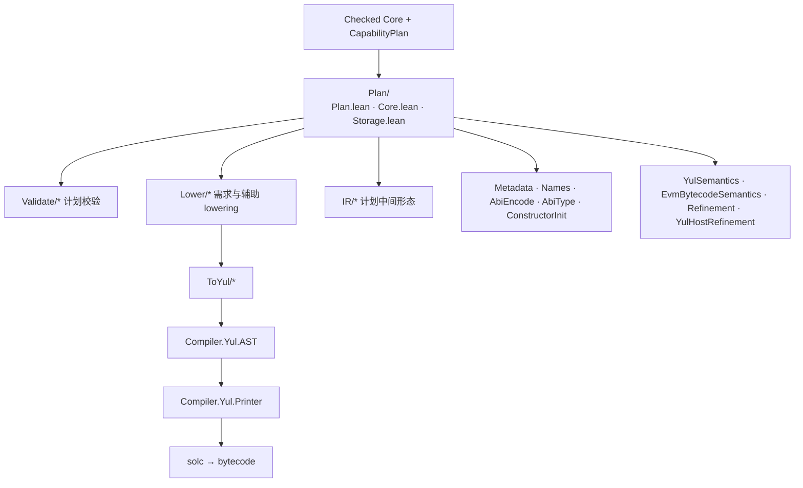

| 阶段 | 模块 | 做什么 |
|---|---|---|
| 计划 | `Plan`, `Plan.Core`, `Plan.Storage` | 入口、存储 packing、ABI、错误、调度元数据 |
| 校验 | `Validate/*` | 固定数组越界、类型、不支持形态 fail-closed |
| 降低 | `Lower/*`, `IR/*` | 从 Core/计划到 Yul 友好形态 |
| 渲染 | `ToYul/*` + `Compiler/Yul` | Yul 文本 |
| 外部 | `solc` | 字节码 |
| 元数据 | `Metadata`, `Abi*`, `ConstructorInit` | selector、constructor、artifact |
| 精化 | `*Semantics`, `Refinement` | 可选语义锚点（非默认产品路径） |

**物理所有权：** slot packing、selector、call/create 模式在 EVM 计划内，不回写 Core。

---

### 5.8 Backend Solana 内部

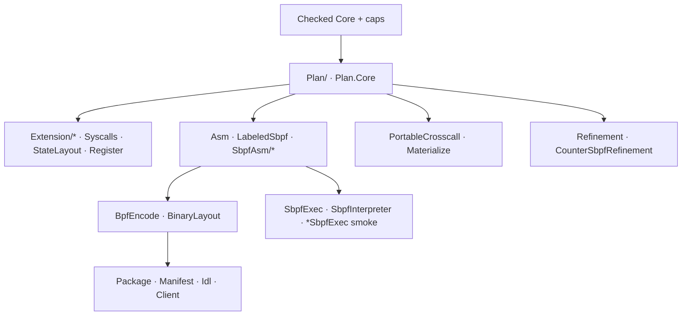

| 阶段 | 模块 | 做什么 |
|---|---|---|
| 计划 | `Plan/*` | 账户图、入口 tag、PDA/CPI 载荷、事件 |
| 扩展 | `Extension`, `Syscalls` | 系统调用与目标扩展 |
| 汇编 | `Asm`, `LabeledSbpf`, `SbpfAsm` | 线性 sBPF 汇编 |
| 编码 | `BpfEncode`, `BinaryLayout` | ELF / 二进制布局 |
| 包 | `Package`, `Manifest`, `Idl`, `Client` | 部署与客户端元数据 |
| 执行烟测 | `SbpfExec*` | 本地解释/对照，非产品 DSL |

**公共作者路径**应经可移植源 + 目标扩展；`Source.Solana` 语法是目标所有权，不是
共享产品教程语言。

---

### 5.9 Backend WasmHost 内部

Wasm 家族共享 **EmitWat** 骨架，链差异在 **HostBridge / 导入 / ABI**。

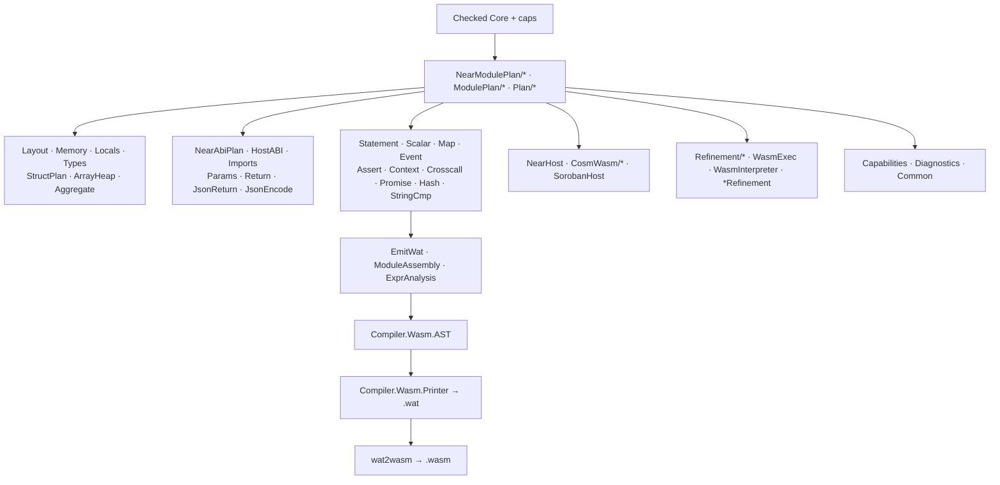

| 块 | 职责 |
|---|---|
| `NearModulePlan` / `ModulePlan` | 从 Core 建 Wasm 宿主计划（函数、布局、导入） |
| 布局/内存 | 线性内存、局部、结构体、数组堆 |
| ABI/JSON | NEAR 风格参数/返回；JSON 返回辅助 |
| 语句降低 | 标量/map/事件/断言/上下文/crosscall/promise… |
| `EmitWat` | 组装 Wasm 模块并打印 WAT |
| Host 桥 | `NearHost` 主产品；`CosmWasmHost` / `SorobanHost` 为 Counter MVP 自定义桥 |
| 解释/精化 | 离线执行与义务锚点 |

**诚实性：** Soroban/CosmWasm 今日多是 **自定义 offline bridge**，不是完整链上 Env；
深度工作受 D-056 / PR #104 排序约束。

---

### 5.10 次级 / 研究后端（Stylus · Psy · Aleo · Quint）

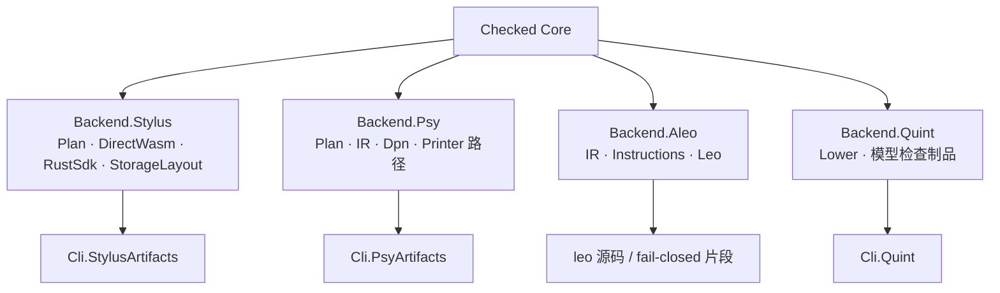

| 目标 | 内部要点 | 成熟度态度 |
|---|---|---|
| Stylus | 独立 `StylusPlan`；默认 Direct HostIO Wasm；Rust SDK 作差分 oracle | Research；需 Nitro 证据才晋级 |
| Psy | Plan → AST → `.psy` → Dargo → DPN JSON | Spike |
| Aleo | 受限 Leo sourcegen；状态导出等 fail-closed | Research |
| Quint | CLI-only 验证车道，不进 `--list-targets` | 验证工具 |

OpenVM：**仅文档**（[openvm-research.md](../targets/openvm-research.md)），无代码路径。

---

### 5.11 验证 / testkit / formal / differential

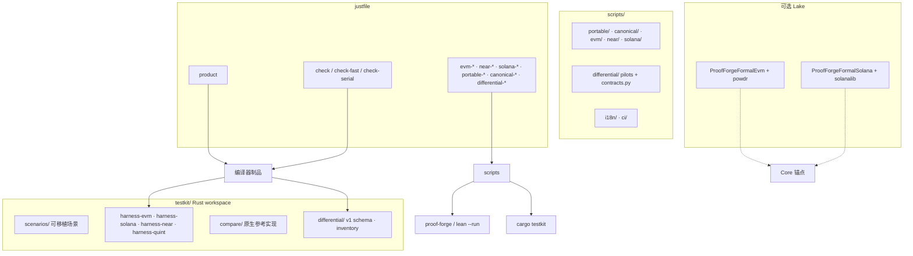

| 层 | 证明什么 |
|---|---|
| `just product` | 产品目录在要求目标上仍可构建 |
| `just check*` | 大规模静态/冒烟矩阵 |
| testkit compare | 与 near-sdk 等参考的尺寸/燃料/离线对照 |
| differential | 八维观察 + fail-closed 语义匹配（独立 Solidity/Pinocchio/near-sdk） |
| Formal 库 | 更深 ISA/语义精化；**默认 `ProofForge` 不依赖** |

---

## 6. 跨边界数据对象

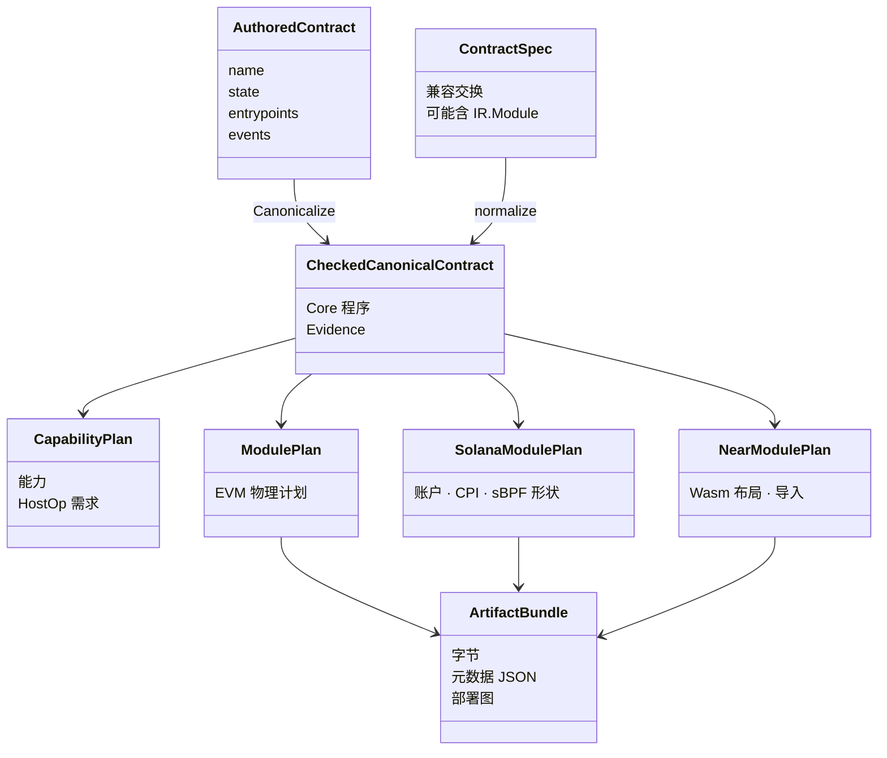

**Evidence ≠ 含义：** 诊断/span/迁移痕迹不得改变能力选择、计划布局或制品哈希。

---

## 7. Worked example：Counter 三链

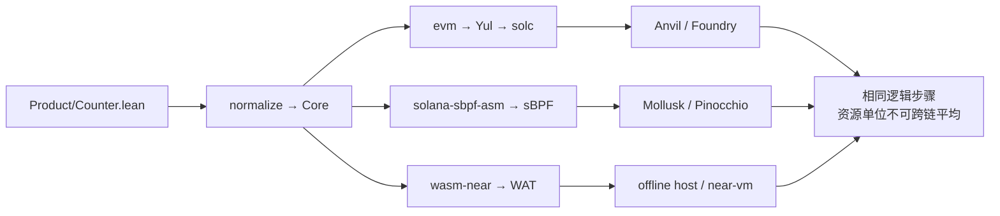

---

## 8. 迁移双路径诚实（必读）

目标收敛路径：

```text
Authored / Intent → Canonical Core → 目标 Plan → 制品
```

| 残留 | 为何还在 | 退出 |
|---|---|---|
| ContractSpec + Legacy 适配 | 对等与渐进 cutover | A-CUT / legacy D* |
| Surface fixture | 前端临时测试 | A-CUT4 |
| NearSpec FT 入口 | 历史 TokenSpec | NEAR-R3–R5 |
| 共享 IR 目标泄漏 | D-054 之前 | IR-B* allowlist 清空 |
| Soroban/CosmWasm 浅桥 | Counter MVP | #104 后深度 |

---

## 9. 组件清单（自检）

### 编译器核心
- [ ] Cli 入口 + TargetDriver
- [ ] 三类 Loader
- [ ] Authored / ContractSpec / Surface
- [ ] CanonicalPipeline
- [ ] IR.Core 四件套 + Semantics
- [ ] CapabilityPlan + HostOp 目录
- [ ] StorageBinding + Crosscall
- [ ] EVM / Solana / WasmHost Plan
- [ ] Yul / Wasm / Psy 打印机
- [ ] Artifact + Metadata

### 产品面
- [ ] Examples/Product + catalog
- [ ] Stdlib 族
- [ ] TokenSpec / NFTSpec
- [ ] Source.Solana 所有权

### 证据
- [ ] just product / check*
- [ ] scripts 各族
- [ ] testkit harness + scenarios
- [ ] differential
- [ ] Formal 可选库

### 非产品但真实
- [ ] Stylus
- [ ] Psy / Aleo
- [ ] Quint CLI
- [ ] OpenVM 仅文档

---

## 10. 如何安全地读代码

1. `ProofForge/Cli.lean` → `Cli/TargetDriver.lean`
2. `Examples/Product/Counter.lean` → `Frontend/Authored/Canonicalize*` →  
   `Compiler/CanonicalPipeline.lean`
3. 任选一个后端：`Backend/Evm/Plan`、`Backend/Solana/Plan`、`Backend/WasmHost/NearModulePlan`
4. 先跑聚焦门禁：

```bash
just product
just check-fast
just portable-counter-multi-target
```

5. 读 `docs/targets/*` 成熟度表，避免把 Counter MVP 当成生产宿主。

---

## 11. 文档维护

边界移动时（新 Frontend 所有者、删除 Legacy、新目标 Plan）必须同步更新：

- 本文 `docs/zh/system-architecture.zh.md`
- 英文 `docs/system-architecture.md`

不要让图示宣传 `rg` / `just` 已不存在的路径。
