# ProofForge System Architecture Map

Status: **Current orientation map (2026-07-15)**

**中文深拆版（分层 + 各组件内部）：**
[zh/system-architecture.zh.md](zh/system-architecture.zh.md).

This document is a **whole-repo architecture picture**: what every major
component is, how data flows at compile time, and how validation/runtime
evidence attaches. It is intentionally visual-first (Mermaid). Source of truth
for *scheduling* remains [AGENTS.md](../AGENTS.md) and the current plans;
source of truth for *behavior* remains code and gates. Section **§12** expands
per-layer internal structure.

Related deep dives:

| Topic | Document |
|---|---|
| Canonical Core route | [architecture.md](architecture.md) |
| Backend obligations | [backend-interface.md](backend-interface.md) |
| Product authoring thesis | [product-authoring-architecture.md](product-authoring-architecture.md) |
| Intent / materializer (D-052) | [Portable Intent design](superpowers/specs/2026-07-12-portable-intent-abstraction-design.md) |
| IR vs target extensions (D-054) | [IR Target Extension Boundary](superpowers/specs/2026-07-14-ir-target-extension-boundary-design.md) |
| Per-target notes | [targets/README.md](targets/README.md) |

> **How to read the diagrams:** GitHub, many IDEs, and common Markdown
> renderers display Mermaid natively. No Excalidraw export is required for
> docs. If you want a free-form whiteboard copy, paste a diagram into
> [Excalidraw](https://excalidraw.com) as a sketch; keep this file as the
> checked-in truth.

---

## 1. One-sentence model

**ProofForge is a Lean 4 multi-target smart-contract compiler:** authors write
portable business logic once; the compiler lowers it through a checked
semantic core into **target-owned plans**, then into chain artifacts (Yul/sBPF/
WAT/…), and proves honesty with capability diagnostics, offline hosts, and
optional formal/differential gates.

```text
  business source  →  checked meaning  →  target plan  →  artifact  →  evidence
     (Lean DSL)         (Canonical Core)   (per chain)     (bin/wat)    (tests)
```

---

## 2. Bird's-eye: whole system

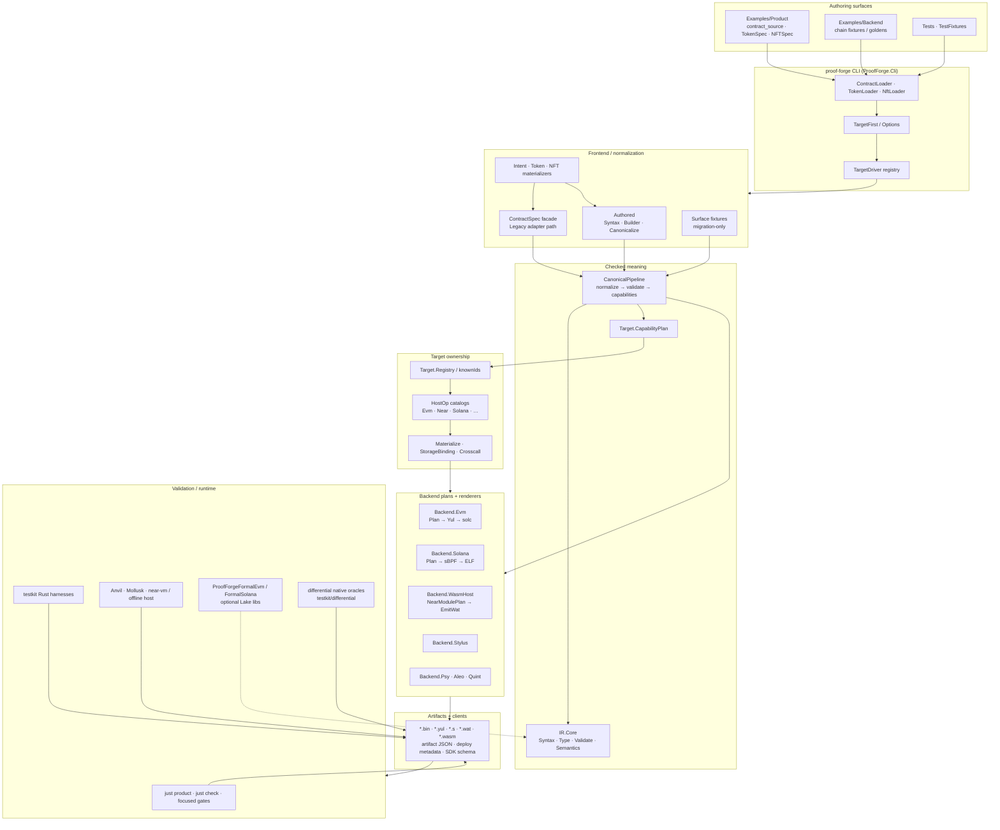

---

## 3. Repository / package layout

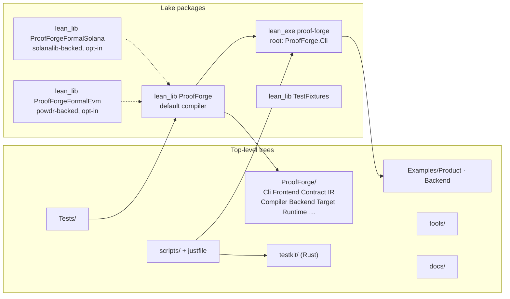

| Path | Role |
|---|---|
| `ProofForge/Cli/` | CLI parsing, loaders, target-first dispatch, emit/build/check, deploy helpers |
| `ProofForge/Frontend/` | Authored DSL normalize, Surface fixtures, ContractSpec facade |
| `ProofForge/Contract/` | Product-facing Source DSL, Stdlib, Token/NFT, Intent, SdkSchema |
| `ProofForge/IR/` | Portable/Legacy IR modules + **Canonical Core** (`IR/Core`) |
| `ProofForge/Compiler/` | Shared pipelines: CanonicalPipeline, Yul/Wasm/Psy printers |
| `ProofForge/Backend/` | Per-target plans and lowerers (Evm, Solana, WasmHost, Stylus, Psy, Aleo, Quint) |
| `ProofForge/Target/` | Registry, capabilities, HostOps, materialization, honesty |
| `ProofForge/Runtime/` | Runtime helpers (e.g. Psy) |
| `ProofForge/Protocols/` | Protocol peer contracts |
| `ProofForge/Util/` | Shared utilities |
| `Examples/Product/` | **Portable product sources** (business logic + `--target`) |
| `Examples/Backend/` | Chain-specific fixtures / goldens |
| `Tests/` | Lean unit/integration smoke |
| `scripts/` + `justfile` | Gate catalog (CI + local) |
| `testkit/` | Rust multi-backend compare / harnesses |
| `ProofForgeFormal/` | Heavyweight optional proofs (not default library) |

**Rule of thumb:** product authors live in `Examples/Product`. Chain plumbing
lives under `Backend/` + `Target/`. Formal proofs never gate the default build.

---

## 4. End-to-end compile pipeline (primary triad)

Public beta product compilers: **`evm`**, **`solana-sbpf-asm`**, **`wasm-near`**.

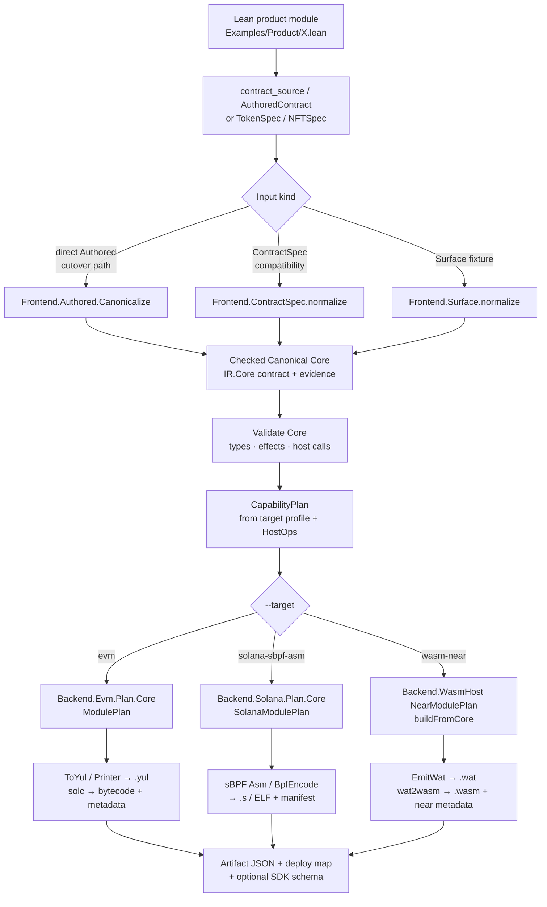

### CLI shape (how a command runs)

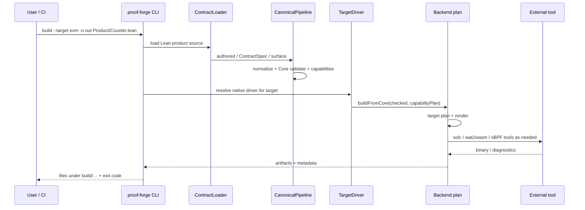

Typical local command:

```bash
lake env proof-forge build --target evm --root . \
  -o build/evm/Counter.bin Examples/Product/Counter.lean
```

---

## 5. Layer inventory (every major component)

### 5.1 Authoring / product layer (`Contract` + `Examples`)

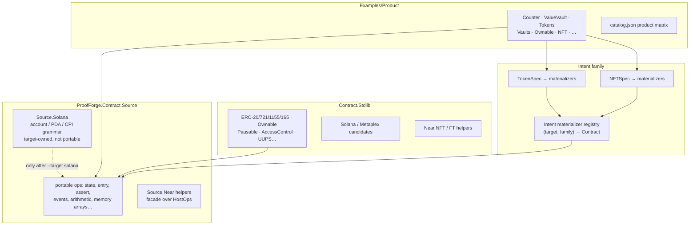

| Component | Responsibility |
|---|---|
| `contract_source` macro | Product-facing Lean DSL → `AuthoredContract` (migration still has ContractSpec paths) |
| `TokenSpec` / `NFTSpec` | Intent-level product APIs; materializers produce contracts per target |
| `Stdlib/*` | Reusable patterns (often EVM-shaped standards with portable cores) |
| `Examples/Product` | **Only** shared business sources for multi-target demos |
| `Examples/Backend` | Target-specific fixtures (not product authoring) |

### 5.2 Frontend normalization

| Module | Input | Output | Notes |
|---|---|---|---|
| `Frontend.Authored.*` | `AuthoredContract` | Canonical Core | Direct cutover path (PR #104 direction) |
| `Frontend.ContractSpec.*` | `ContractSpec` / Legacy IR | Canonical Core | Compatibility facade during migration |
| `Frontend.Surface.*` | Temporary Surface AST fixtures | Canonical Core | Not product; deletion after A-CUT parity |
| `Frontend.Materialize` | Intent contracts | Concrete contracts | Registry-driven, no frontend `targetId` switch for portable ops |

**Non-negotiable:** portable normalization must not branch on `targetId`.
Target choice happens at the CLI / materializer boundary.

### 5.3 Canonical Core (`IR/Core`)

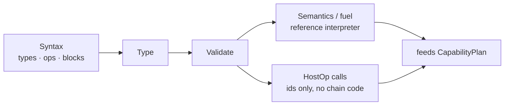

Core owns **logical** meaning only:

- scalars / maps / arrays / control flow / asserts / events as semantic ops;
- `hostCall` carriers with versioned ids;
- **no** EVM slots, Solana account layouts, NEAR promise constructors in the
  long-term shared inductive (migration: IR-B* / D-054).

Physical layout is always a **target plan** concern.

### 5.4 Target layer (`ProofForge.Target`)

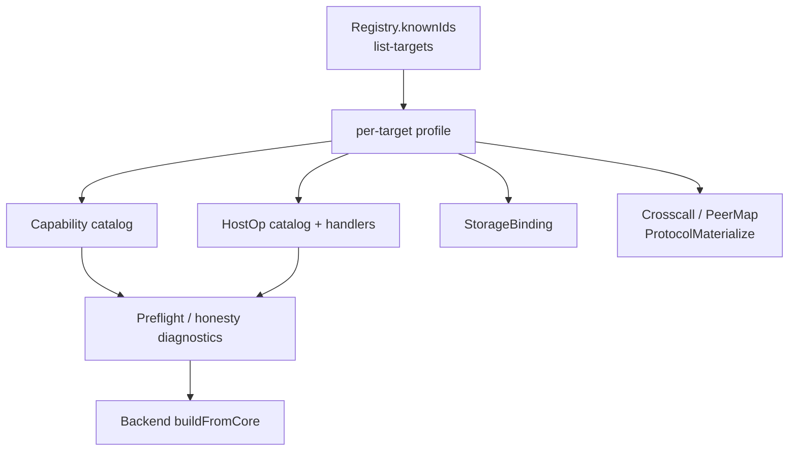

| Piece | Role |
|---|---|
| `Registry` | Declares target ids and maturity-facing metadata |
| `Capability` | Open stable capability ids required by a program |
| `HostOp` / `HostOps/*` | Typed, versioned chain ops (EVM protocol, NEAR host, Solana syscalls…) |
| `StorageBinding` | Logical state → chain storage model |
| `Materialize` / `Crosscall*` | Peers, protocols, remote-call shapes |
| `PortableHonesty` | Fail-closed “we do not pretend” diagnostics |

### 5.5 Backends (plans → artifacts)

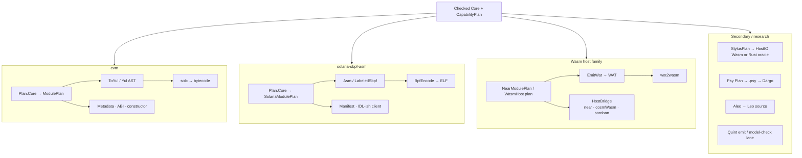

| Target id | Plan owner | Artifact path | Evidence tools |
|---|---|---|---|
| `evm` | `Backend.Evm.Plan` | Yul → `solc` bytecode | Foundry, Anvil |
| `solana-sbpf-asm` | `Backend.Solana.Plan` | sBPF asm → ELF | Mollusk, Surfpool, Pinocchio |
| `wasm-near` | `Backend.WasmHost` Near plan | WAT → Wasm | offline host, `near-vm-runner` |
| `wasm-cosmwasm` | WasmHost + CosmWasm bridge | WAT → Wasm | cosmwasm-check, offline host |
| `wasm-stellar-soroban` | WasmHost + Soroban bridge | WAT → Wasm | custom offline host only |
| `wasm-arbitrum-stylus` | `Backend.Stylus` | HostIO Wasm / Rust | stylus gates, Nitro later |
| `psy-dpn` | `Backend.Psy` | `.psy` + Dargo | dargo execute |
| `aleo-leo` | `Backend.Aleo` | Leo package | leo build (restricted) |
| `quint` | CLI-only | Quint models | model-check lane |

### 5.6 CLI surface (`ProofForge.Cli`)

| Area | Modules (representative) | Job |
|---|---|---|
| Entry | `Cli.lean` `main` | Parse argv, exit codes |
| Target-first | `TargetFirst`, `TargetDriver`, `Options` | Map user flags → native ops |
| Loaders | `ContractLoader`, `TokenLoader`, `NftLoader` | Resolve Lean product sources |
| Emit/build | `EvmArtifacts`, `SolanaArtifacts`, `EmitWatArtifacts`, `StylusArtifacts`, `PsyArtifacts` | Write files under `build/` |
| Metadata | `Metadata`, `Artifact`, `ConstructorAbi`, `EvmAbi` | JSON / deploy / ABI honesty |
| Deploy helpers | `Deploy`, `SolanaCommands`, `WasmNearCommands` | Local deploy smoke wrappers |
| Check | `Check` | Static check routes |

### 5.7 Validation, testkit, formal, differential

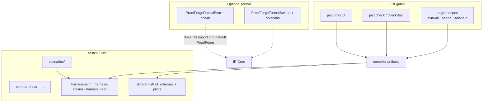

| Layer | What it proves |
|---|---|
| `just product` | Portable product catalog still builds for required targets |
| `just check` | Large parallel static/smoke matrix |
| testkit compare | Size/fuel/offline equivalence vs native references |
| differential pilots | Fail-closed multi-dimension semantic match vs independent Solidity/Pinocchio/near-sdk |
| Formal libs | Deeper refinement against external ISA/semantics (opt-in, heavy) |

---

## 6. Data objects that cross boundaries

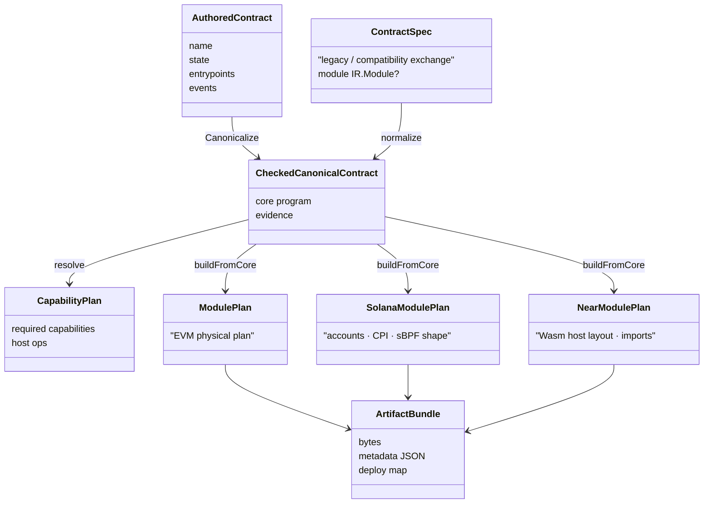

**Evidence vs meaning:** diagnostics / spans / migration traces must not change
capability selection, plan layout, or artifact hashes
([architecture.md](architecture.md)).

---

## 7. Worked example: Counter across three targets

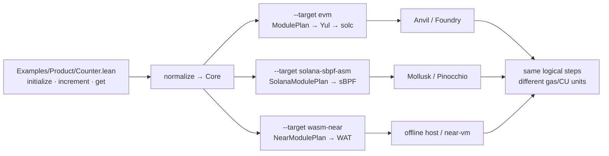

Same source, three plans, three runtimes. Resources (gas, CU, fuel) stay
**target-local** and are never averaged into a fake cross-chain score.

---

## 8. Migration / dual-path honesty (read this)

The architecture is **converging** to one production path:

```text
Authored / Intent → checked Canonical Core → target plan → artifact
```

Still present during migration (do not treat as product features forever):

| Residual | Why it exists | Exit |
|---|---|---|
| `ContractSpec` + Legacy IR adapters | Parity and gradual cutover | A-CUT / legacy-replacement D* |
| Surface fixtures | Temporary frontend tests | A-CUT4 |
| NEAR `NearSpec` product FT entry | Historical TokenSpec path | NEAR-R3–R5 |
| Shared IR target leakage | Pre-D-054 constructors | IR-B* allowlist → empty |
| Secondary hosts (Soroban/CosmWasm) | Counter MVP bridges | depth after D-056 / #104 |

PR **#104** (direct authoring cutover + native differential) is the active
merge that rewrites the authoring spine; secondary host depth waits on it
(D-056).

---

## 9. Component checklist (inventory)

Use this as a “have I understood every box?” list.

### Compiler core
- [ ] `Cli` entry + TargetDriver
- [ ] Loaders (contract / token / NFT)
- [ ] Authored / ContractSpec / Surface frontends
- [ ] CanonicalPipeline
- [ ] IR.Core syntax/type/validate/semantics
- [ ] CapabilityPlan
- [ ] HostOp open catalogs
- [ ] StorageBinding + crosscall materialize
- [ ] EVM / Solana / WasmHost plans
- [ ] Yul / Wasm / Psy printers
- [ ] Artifact + metadata writers

### Product surfaces
- [ ] `Examples/Product` catalog
- [ ] Stdlib families
- [ ] TokenSpec / NFTSpec materializers
- [ ] Solana grammar ownership under `Source.Solana`

### Evidence
- [ ] `just product` / `just check*`
- [ ] scripts under `scripts/{evm,near,solana,portable,canonical,differential}`
- [ ] testkit harnesses + scenarios
- [ ] optional formal Lake libs
- [ ] differential reference corpus

### Non-product but real
- [ ] Stylus hybrid backend
- [ ] Psy / Aleo research sourcegen
- [ ] Quint CLI verification lane
- [ ] OpenVM **docs-only** brief (no code path)

---

## 10. How to explore the code safely

1. Start at `ProofForge/Cli.lean` (`main`) and `Cli/TargetDriver.lean`.
2. Follow one product: `Examples/Product/Counter.lean` → frontend normalize →
   `Compiler/CanonicalPipeline.lean`.
3. Open one backend plan: `Backend/Evm/Plan`, `Backend/Solana/Plan`, or
   `Backend/WasmHost`.
4. Run a focused gate, not the whole matrix:

```bash
just product          # product-first CI gate
just check-fast       # affected-path inner loop
just portable-counter-multi-target
```

5. Read target notes under `docs/targets/` for maturity honesty before
   assuming a route is production-ready.

---

## 11. Document maintenance

When a **layer boundary** moves (new frontend owner, deleted Legacy path, new
target plan), update **this map** in the same change as the design/plan
update. Do not let this file advertise a path that `rg` and `just` gates no
longer implement.

---

## 12. Layer-deep internals

Chinese deep-dive (same diagrams, full narrative):
[system-architecture.zh.md](zh/system-architecture.zh.md).

### 12.1 CLI internals (`ProofForge/Cli`)

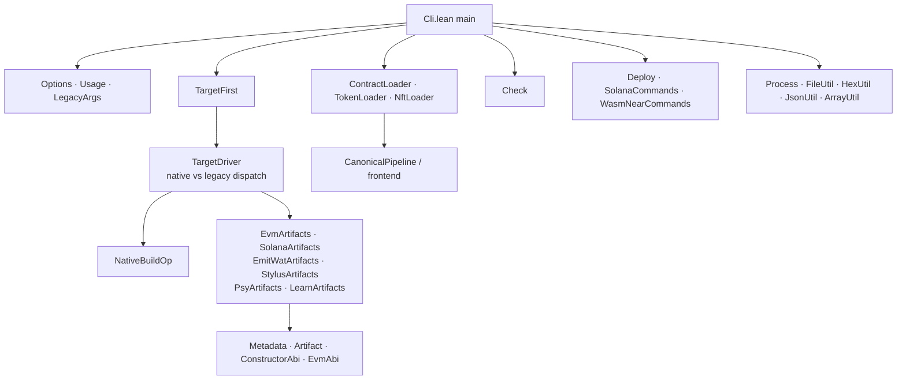

### 12.2 Frontend internals

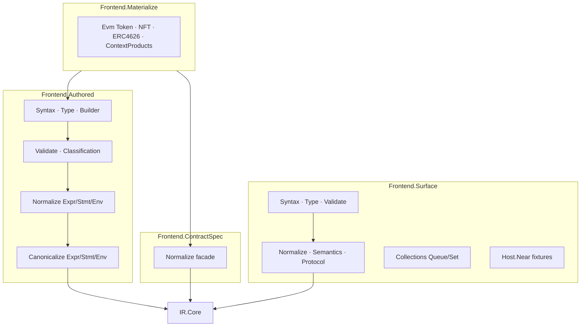

### 12.3 Canonical Core internals (`IR/Core`)

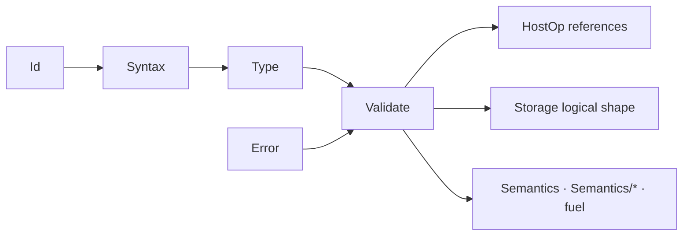

### 12.4 Target layer internals

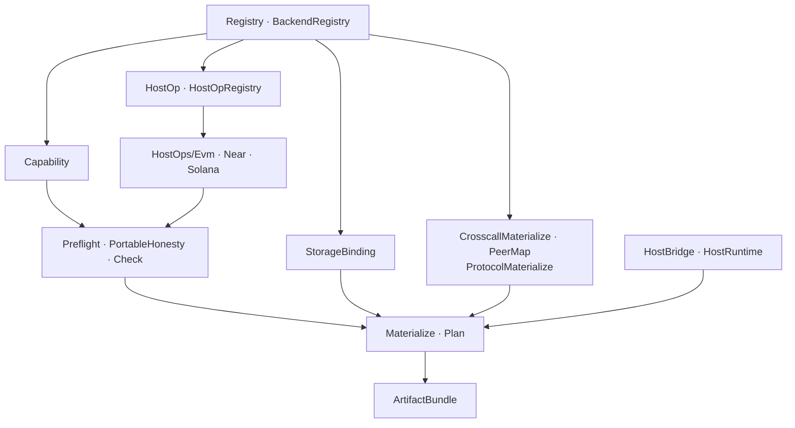

### 12.5 EVM backend internals

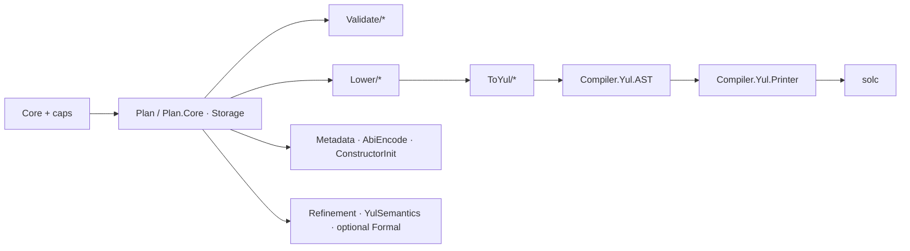

### 12.6 Solana backend internals

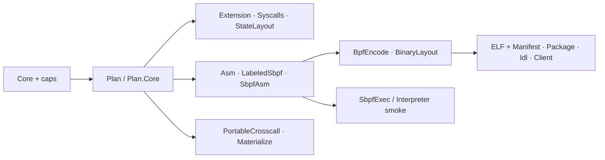

### 12.7 WasmHost backend internals

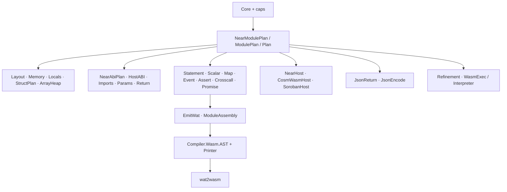

### 12.8 Validation stack internals

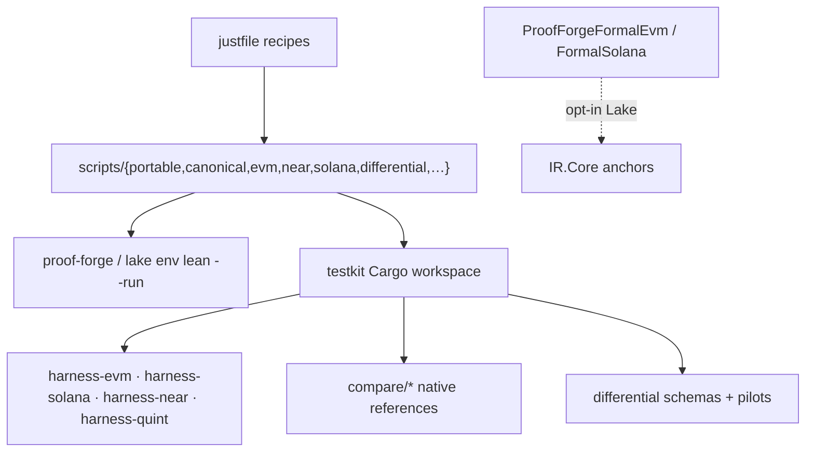
