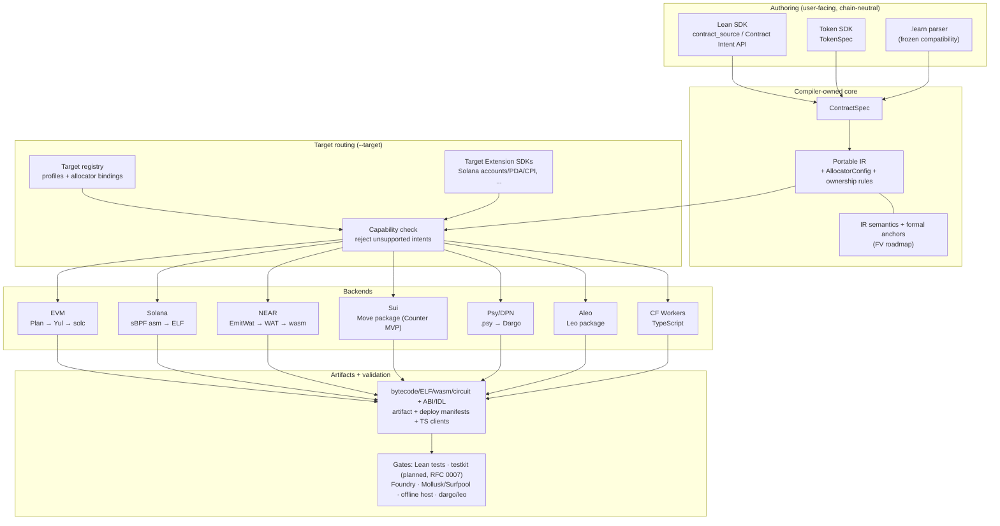

# ProofForge

Lean 优先的多链智能合约平台。

ProofForge 的目标是实现一套经过验证的 Lean 合约代码库，能够跨多个区块链目标家族进行编译、测试和部署。合约基于链中立的 Contract Intent API 编写；编译器将它们降级为可移植 IR，根据每个目标路由能力，并发射链原生制品。不支持的目标能力将在编译时被拒绝，而不是静默地改变语义。

从这里开始：

- [docs/INDEX.md](../INDEX.md) — 完整文档地图。
- [RFC 0001](../rfcs/0001-multichain-platform.md) — 多链架构与路线图；[RFC 0002](../rfcs/0002-target-implementation-design.md) — 目标实现设计。
- [Design decisions](../decisions.md) — 已确定的决策 (D-001…D-045)。
- [Formal verification roadmap](../formal-verification.md) — 现有的证明锚点与阶段性定理目标。
- [Demo recording](https://asciinema.org/a/fn6o6kSxB5RpMXJl) — 终端演示：编写 → 编译 → 部署 → 测试。

中文文档：

- [中文文档索引](README.md)
- [架构评审（2026-07）：统一 SDK 输入与分支收敛](architecture-review-2026-07.md)
- [多链愿景可行性分析](feasibility-analysis.md)

## Backend Status

机器可读的支持矩阵（成熟度、输入模式、命令、输出阶段、验证级别）由 `proof-forge --list-targets --json` 生成至 [`docs/generated/backend-status.md`](../generated/backend-status.md) (`just target-support` / `just backend-status-gen`)。下方的叙述表是人工概览；生成的表格仍作为 PF-P1-02 合约。

### Beta-ready `contract_source` 目标

这三个目标编译真实的 `ProofForge.Contract.Source` 合约，生成规范的 SDK 布局，并被要求通过 `just product`：

| 目标 id | 流水线 | 阶段 | 本地验证 |
|---|---|---|---|
| `evm` | Lean / 可移植 IR → Yul → `solc` → 字节码 | Beta-ready | 黄金 Yul、诊断、Foundry 运行时冒烟测试、Anvil 部署、动态构造函数 Anvil、构造函数主体、部署 gas-limit/price/priority 标志、stdlib 覆盖 |
| `solana-sbpf-asm` | 可移植 IR → sBPF 汇编 → `sbpf` → ELF | Beta-ready | Mollusk 测试、Surfpool/Rust 实时冒烟测试、Pinocchio 等价门、索引事件、CPI 门、Token-2022 扩展、map 存储 |
| `wasm-near` | 可移植 IR → `EmitWat` (Wasm AST → WAT) → `wat2wasm` | Beta-ready | 诊断、IR 覆盖清单、形式化追踪义务、目标优先冒烟测试、离线宿主冒烟测试、NEP-141 FT stdlib、聚合 ABI 参数 |

### Counter-MVP / research spike (非 beta-ready)

以下目标在 `main` 上实现，但有意限制在 Counter 固件、宿主适配器 spike 或研究原型。它们**不**作为公开测试版 `contract_source` 编译器进行宣传：

| 目标 id | 状态 | 降级原因 |
|---|---|---|
| `wasm-stellar-soroban` | Counter MVP (PF-P3-02) | Auth 仍为 spike-always；Stellar CLI/TTL 仍为后续工作。 |
| `wasm-cosmwasm` | Counter MVP (PF-P3-02) | `execute_msg` 是一个 WasmMsg 形状的存根；完整的跨调用尚未连接。 |
| `move-aptos` | Counter spike (PF-P3-02) | 产品源 fail-closed；需要 `aptos` CLI 进行验证。 |
| `move-sui` | Counter MVP | 仅限 Counter 包布局；Counter 之外的规划正在进行中。 |
| `psy-dpn` | Research spike (受限子集) | 仅限 Dargo 支持的执行；非通用编译器。 |
| `aleo-leo` | Counter MVP / research (Road 1+) | 通用 Leo 源代码生成 + ALU 操作；更广泛的形状覆盖正在进行中。 |
| `wasm-cloudflare-workers` | Counter TS spike (PF-P3-02) | TypeScript Worker 输出；非 Wasm 二进制目标。 |

**仅限 CLI 的验证目标：** `quint` 被 `proof-forge emit --target quint` 接受用于形式化/模型检测固件，但**不**在 `Target.knownIds` / `--list-targets` 中（验证通道，而非产品宿主）。

多链 Token SDK (`TokenSpec`, [RFC 0006](../rfcs/0006-multichain-token-sdk.md)) 将一个代币意图路由到 EVM 上的 ERC-20 字节码，或 Solana 上的 SPL Token / Token-2022 部署计划。

## 快速开始

从 [casey/just](https://github.com/casey/just) 安装 `just`；根 `justfile` 是面向开发者的命令目录和 CI 入口。

```sh
just --list        # all recipes
just build         # lake build
just product       # product-first: Examples/Product multi-target matrix (required CI)
just check         # product + backend static gates (Lean + Solana-light + NEAR + Psy + testkit + …)
just evm-all       # full EVM gates: examples, Foundry smoke, Anvil deploy
just portable-counter-four-target-sdk  # Counter SDK layout for EVM, Solana, NEAR, Sui
just sui-counter-smoke                 # local Sui Move Counter build/test
just ci            # the full CI sequence locally
```

直接使用 Lake 构建：

```sh
lake build
```

将 EVM Counter 示例编译为运行时字节码：

```sh
lake env proof-forge build --target evm --root . \
  -o build/evm/Counter.bin Examples/Product/Counter.lean
```

从内置的可移植 IR fixtures 为其他目标发射制品：

```sh
lake env proof-forge emit --target wasm-near --fixture counter --format wat -o build/wasm-near
lake env proof-forge emit --target solana-sbpf-asm --fixture counter --format elf -o build/solana/counter.so
lake env proof-forge emit --target move-sui --fixture counter --format sui -o build/sui
lake env proof-forge emit --target psy-dpn --fixture counter --format psy -o build/psy/Counter.psy
lake env proof-forge emit --target aleo-leo --fixture counter --format leo -o build/aleo
lake env proof-forge emit --target wasm-cloudflare-workers --fixture counter --format ts -o build/ts/Counter.ts
```

完整的、针对每个目标的可运行验证命令及其工具先决条件（Foundry, `solc`, `sbpf`, `wat2wasm`, `dargo`, `leo`, `wrangler`, …）列表位于 [docs/validation-gates.md](../validation-gates.md)。
云/代理环境说明位于 [AGENTS.md](../../AGENTS.md)。

## 架构



- **Contract Intent API** — 默认的 SDK 界面：状态、入口、事件、调用者/金额访问、检查算术、断言和证明，无需导入目标链模块。
- **Target Extension SDKs** — 当合约需要时提供显式的链原生语义（Solana 账户/PDA/CPI、分配器选择等）。扩展通过能力 id 和目标元数据进行降级，绝不通过向可移植 IR (D-027) 添加仅限链的构造函数来实现。
- **目标适配器** — 每个目标家族的 ABI、打包、测试运行器和部署逻辑；`--target` 选择适配器，不支持的意图将在制品生成 (D-028) 之前被拒绝。

参见 [docs/authoring-model.md](../authoring-model.md) 了解编写层（旧版 `.learn` 解析器是一个冻结的兼容性界面，而不是第二种产品语言），以及 [docs/portable-ir.md](../portable-ir.md) 了解 IR 规范。可编辑的 [Excalidraw 架构图](../diagrams/README.md)（在 [excalidraw.com](https://excalidraw.com) 上打开）是对上方 Mermaid 图表的补充。

## 开发文档

- [开发标准](../development-standards.md)
- [验证门禁](../validation-gates.md)
- [实现待办事项](../implementation-backlog.md) — 工作流 24（合并后跟进）和工作流 25（形式化验证）是当前的优先级。
- [能力注册表](../capability-registry.md)
- [共享场景：Counter](../shared-scenario.md) — 跨目标验收测试；当前阶段的目标是在 `evm`、`solana-sbpf-asm` 和 `wasm-near` 上通过测试。
- 目标说明：[docs/targets/](../targets/README.md)

## 编写模块命名

- **可移植编写模块：** `ProofForge.Contract.Source`（新的链中立合约和模板的默认选择）。
- **目标选择：** `proof-forge --target <id>` 在构建/发射时选择 EVM、Solana、NEAR、Sui 或其他后端；可移植合约源码不应仅为了选择输出链而导入目标链模块。
- **EVM 原生模块：** 带有命名空间 `Lean.Evm` 的 `ProofForge.Evm` 仍保留用于旧版 EVM 示例和显式的仅限 EVM 的适配器工作。

`Lean.Evm` 命名空间源自 Lean 分叉迁移。重命名为统一的 `ProofForge.*` 命名空间已在待办事项（工作流 24）中跟踪，因为 `Lean.Evm` 遮蔽了 Lean 编译器自身的 `Lean` 命名空间。

## 路线图

```text
Phase 0: EVM baseline                      (done)
Phase 1: target registry + portable IR     (done)
Phase 2+: parallel backend spikes          (Solana, NEAR, Psy on main;
                                            Sui Counter MVP;
                                            Aleo, CF Workers research)
Phase 3:  three-chain P0 SDK cleanup        (done — 0 open P0 blockers;
                                            Counter + ValueVault portable
                                            on evm + solana-sbpf-asm + wasm-near)
Current:  P1 feature expansion — full NEAR Promise async execution,
          Solana map storage, EVM dynamic constructor args runtime,
          Sui beyond-Counter planning, Pinocchio reference breadth,
          formal verification (Workstream 25)
Later:    Move family expansion, cloud platform (after two+ targets reach
          Experimental with shared-scenario parity; D-010)
```

规范的目标 id 以及完整的决策日志：[docs/decisions.md](../decisions.md)。
文件名 `docs/targets/solana-sbf.md` 是 Solana 目标笔记的历史别名；规范路径为 `solana-sbpf-asm` (D-026)。
